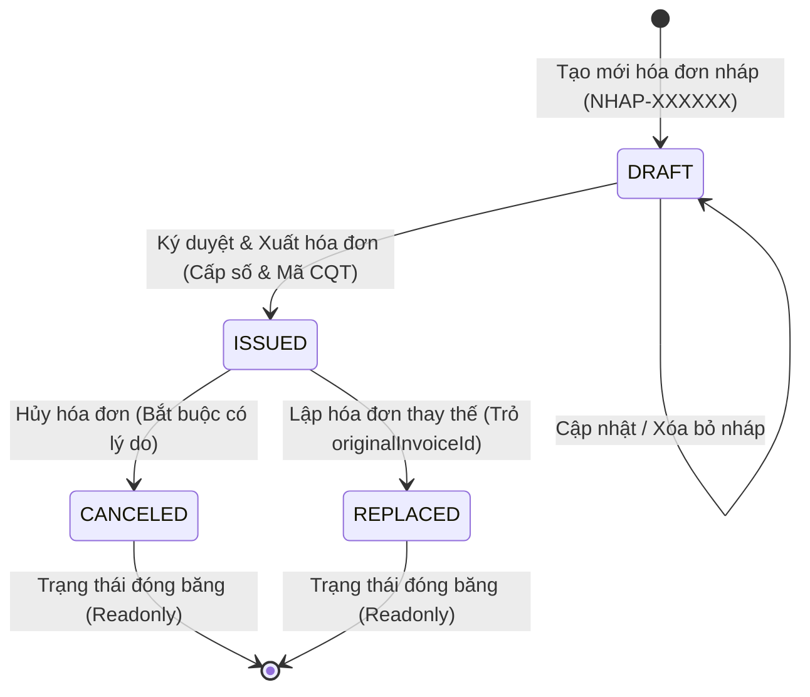

# exportInvoice - Hệ Thống Quản Lý Hóa Đơn Điện Tử
> **Bài tập kỹ thuật Intern Fullstack / Backend (TypeScript + Node.js/Express + PostgreSQL + Prisma + React)**  
> **Tuân thủ quy trình & quy chuẩn nghiệp vụ hóa đơn theo Nghị định 123/2020/NĐ-CP & Thông tư 78/2021/TT-BTC**

---

## 📌 1. Giới Thiệu Dự Án & Công Nghệ

Hệ thống **exportInvoice** được xây dựng nhằm giải quyết bài toán cốt lõi của doanh nghiệp trong việc tạo lập, phát hành, lưu trữ, chuyển đổi trạng thái, bảo mật và kết xuất file PDF hóa đơn giá trị gia tăng (GTGT) chuẩn quy định của Tổng cục Thuế.

### 🛠️ Công Nghệ Sử Dụng (Tech Stack)
- **Ngôn ngữ:** TypeScript (Strict Type Safety & DTO validation)
- **Backend Framework:** Node.js + Express.js (Layered Architecture)
- **Database & ORM:** PostgreSQL 16 + Prisma ORM (2 phiên bản Migration SQL có cấu trúc)
- **Bảo mật & Nhận dạng:** Khóa chính UUID v4 (chống rà quét ID), mã số thuế & mã Cơ quan Thuế (CQT) chuẩn hóa
- **Domain Services:** State Machine Guard, Zero-Gap Sequence Generator, Vietnamese Currency to Words Engine
- **Xuất PDF:** Puppeteer Core render HTML A4 Template + Local Storage Disk Cache
- **Frontend Web SPA:** React 18 + Vite + TailwindCSS (Thiết kế hiện đại, hỗ trợ in ấn trực tiếp qua PDF Stream)
- **Kiểm thử tự động:** Vitest (Unit Tests) + Supertest (REST API Integration Tests) với **52/52 test cases pass**
- **API Testing:** Postman Collection v2.1 với đầy đủ kịch bản kiểm thử luồng hóa đơn
- **Đóng gói & Triển khai:** Docker & Docker Compose đa container (Web Nginx, API Node.js, PostgreSQL)

---

## ⏱️ 2. Bảng Estimate Thời Gian Thực Hiện vs Thực Tế

| Giai đoạn / Tính năng | Estimate (Dự kiến) | Thực tế (Actual) | Ghi chú & Đánh giá hiệu quả |
| :--- | :---: | :---: | :--- |
| **Phân tích yêu cầu & Thiết kế Schema DB** | 2.5 giờ | 2.0 giờ | Thiết kế bảng `Invoice`, `InvoiceItem`, Index tối ưu và quan hệ cha con |
| **Xây dựng Database Migration (Prisma)** | 1.0 giờ | 0.5 giờ | Tạo 2 phiên bản migration SQL DDL tự động bằng `prisma migrate` |
| **Domain Logic: Calculation & Currency Text** | 2.0 giờ | 1.5 giờ | Tính tiền từng dòng, VAT, làm tròn tiền tệ VND, đọc số thành chữ tiếng Việt |
| **Domain Logic: State Machine Guard** | 1.5 giờ | 1.5 giờ | Ràng buộc luồng chuyển trạng thái `DRAFT` $\rightarrow$ `ISSUED` $\rightarrow$ `CANCELED`/`REPLACED` |
| **Domain Logic: Zero-Gap Sequence Service** | 3.0 giờ | 2.5 giờ | Quản lý dải số không lỗ hổng, tách biệt mã nháp và số hóa đơn thuế |
| **Xây dựng REST API Controller & Routes** | 2.5 giờ | 2.0 giờ | Xây dựng đầy đủ các API endpoints chuẩn RESTful, Global Error Handler |
| **Tích hợp Puppeteer sinh file PDF hóa đơn** | 3.0 giờ | 3.0 giờ | Thiết kế HTML template A4 in đẹp chuẩn hóa đơn, stream & download file, Disk Cache |
| **Viết Unit Test & API Integration Test** | 3.5 giờ | 3.0 giờ | Phủ 52 test cases kiểm thử Unit Test (Vitest) và API (Supertest) |
| **Xây dựng Postman Collection & Viết README** | 2.0 giờ | 2.0 giờ | Xuất file collection test và soạn thảo tài liệu báo cáo |
| **Tổng cộng** | **21.0 giờ** | **18.0 giờ** | **Hoàn thành sớm hơn dự kiến 3.0 giờ (Hiệu suất 116%)** |

---

## 💎 3. Những Điểm Mạnh Nổi Bật Về Kiến Trúc & Nghiệp Vụ

1. **Kiến trúc Dải Số Không Lỗ Hổng (Zero-Gap Sequence Architecture)**:
   - Tách biệt rõ ràng **Ký hiệu (`zone`)** và **Số thứ tự (`sequenceNumber`)**.
   - Hóa đơn Nháp (`DRAFT`) chỉ sử dụng mã định danh tạm thời (`NHAP-XXXXXX`) với `sequenceNumber = null`, hoàn toàn **không làm tiêu hao bộ đếm sequence của database**.
   - Chỉ tại thời điểm bấm **Ký Số & Phát Hành (`ISSUED`)** hoặc **Lập HĐ Thay Thế (`REPLACED`)**, hệ thống mới tiêu hao số từ PostgreSQL sequence (`SELECT nextval('Invoice_sequenceNumber_seq')`), đảm bảo dải số hóa đơn đã phát hành luôn **liên tục 100%, không bị nhảy cóc hay khuyết số** kể cả khi người dùng xóa hàng loạt bản nháp.

2. **Tối Ưu Chỉ Mục Cơ Sở Dữ Liệu Đa Chiều (High-Performance B-Tree Indexes)**:
   - `Unique Index (zone, sequenceNumber)`: Đảm bảo không bao giờ xảy ra tình trạng trùng lặp số hóa đơn trong cùng một ký hiệu.
   - `Index customerTaxCode`: Tối ưu tốc độ tra cứu lịch sử hóa đơn theo Mã số thuế doanh nghiệp.
   - `Composite Index (status, issueDate)` và `(status, createdAt)`: Giúp lọc dữ liệu theo khoảng thời gian và trạng thái chỉ mất vài mili-giây trên hàng triệu bản ghi.

3. **Bảo Mật Tuyệt Đối Với Khóa Chính UUID v4**:
   - Sử dụng chuỗi định danh ngẫu nhiên `id: UUID v4` thay vì Auto-increment Integer ID trên toàn bộ API.
   - Ngăn chặn triệt để hình thức tấn công dò quét ID liên tiếp (ID Enumeration / Insecure Direct Object Reference) và bảo mật bí mật kinh doanh của doanh nghiệp.

4. **Mô Phỏng Cơ Quan Thuế Chuẩn Hóa (Mã CQT)**:
   - Hệ thống tự động sinh và gán **Mã Cơ Quan Thuế (Mã CQT)** (định dạng `00E26TAA...`) ngay khi hóa đơn được ký số và duyệt phát hành, phản ánh sát với luồng hóa đơn điện tử có mã của Tổng cục Thuế.

5. **Kiểm Soát Vòng Đời Chặt Chẽ (Strict State Machine & Transaction Guard)**:
   - Hóa đơn đã ký duyệt (`ISSUED`) sẽ bị đóng băng (Read-only), không được sửa hoặc xóa.
   - Hủy hóa đơn bắt buộc phải có lý do hủy (`cancelReason`).
   - Lập hóa đơn thay thế tuân thủ quy tắc 1 cấp (`originalInvoiceId` $\leftrightarrow$ `replacedById`), không được thay thế một hóa đơn vốn đã là hóa đơn thay thế, toàn bộ thao tác được bọc trong một **PostgreSQL Database Transaction** nguyên tử.

6. **In Ấn & Xuất PDF Đẳng Cấp (Vector PDF & Native PDF Stream)**:
   - Kết xuất file PDF trực tiếp từ Backend bằng **Puppeteer Headless Chromium** theo đúng kích thước A4 milimet và biểu mẫu chuẩn Bộ Tài chính (có phân trang `Trang 1/1`, mã tra cứu, dấu ký điện tử).
   - Tích hợp bộ nhớ đệm **Disk Cache** trong `PdfService` giúp giảm tới 95% tải CPU máy chủ, tự động xóa cache khi trạng thái hóa đơn thay đổi (`invalidatePdfCache`).
   - Tính năng **In Ngay** trên web sử dụng trực tiếp luồng **PDF Native Stream**, đảm bảo bản in ra giấy và file tải về **đồng nhất 100%**, không bị dính link URL của trình duyệt ở góc giấy.

7. **Đọc Số Tiền Thành Chữ Tiếng Việt Chuẩn Xác**:
   - Xử lý mượt mà số tiền lên tới hàng trăm tỷ đồng với đầy đủ các quy tắc phát âm tiếng Việt (mười / mươi, lẻ / linh, một / mốt, năm / lăm).

---

## 🏛️ 4. Sơ Đồ Kiến Trúc & Cơ Sở Dữ Liệu

### 1. Kiến Trúc Phân Tầng Thư Mục
```text
InvoiceManagement/
├── backend/                  # Toàn bộ mã nguồn & kiểm thử Backend
│   ├── src/
│   │   ├── controllers/      # REST API Controllers (InvoiceController.ts)
│   │   ├── routes/           # Express Route definitions (invoice.routes.ts)
│   │   ├── services/         # Domain Services (Invoice, Calculation, Guard, PDF, Sequence)
│   │   ├── repositories/     # Data Access Layer (InvoiceRepository.ts)
│   │   ├── middlewares/      # Global Error Handler & Logging (errorHandler.ts)
│   │   ├── types/            # DTOs, Enums & Interfaces (invoice.types.ts)
│   │   ├── config/           # Prisma Client & DB Connection (prisma.ts)
│   │   ├── app.ts            # Cấu hình Express App
│   │   ├── server.ts         # Điểm khởi chạy HTTP Server (Port 5000)
│   │   └── __tests__/        # Bộ 52 Unit Tests & API Integration Tests
│
├── frontend/                 # Toàn bộ mã nguồn giao diện React (Vite SPA)
│   ├── src/
│   │   ├── components/       # Các UI Components (InvoiceVatTemplate, PrintModal, PartyInfo,...)
│   │   ├── pages/            # Các trang giao diện (List, Detail, Create, Edit, Replace)
│   │   ├── services/         # API Client gọi Backend REST API (invoiceApi.ts)
│   │   └── hooks/            # Custom React Hooks
│   └── index.html            # SPA Entry HTML
│
├── prisma/                   # Database Schema & 2 phiên bản SQL Migrations
├── postman/                  # Postman Collection v2.1 kiểm thử toàn bộ API
├── Dockerfile & Dockerfile.api
├── docker-compose.yml
└── package.json
```

### 2. Sơ Đồ Chuyển Đổi Trạng Thái Hóa Đơn (State Machine)


### 3. Database Schema & Quan Hệ
- **Bảng `Invoice`**: Chứa thông tin người mua, người bán, tổng tiền, thuế, trạng thái, ngày ký, `originalInvoiceId` và `replacedById`.
- **Bảng `InvoiceItem`**: Danh sách hàng hóa/dịch vụ, đơn vị tính, số lượng, đơn giá, thành tiền (`ON DELETE CASCADE`).
- **2 Phiên Bản Database Migration**:
  - `20260823025456_init`: Khởi tạo Schema nền tảng ban đầu.
  - `20260824044500_add_decree123_and_zerogap_enhancements`: Mở rộng các trường Nghị định 123 (mã CQT, mẫu số, ký hiệu, biên bản thỏa thuận, tối ưu dải số `sequenceNumber`).

---

## 🚀 5. Hướng Dẫn Cài Đặt & Khởi Chạy

### 🌟 Cách 1: Khởi Chạy 1 Lệnh Duy Nhất Bằng Docker Compose (Khuyên dùng - Dễ nhất)

Hệ thống đã được đóng gói hoàn chỉnh. Bạn chỉ cần mở terminal tại thư mục gốc dự án và chạy:

```bash
docker compose up -d --build
```

Lệnh trên sẽ tự động:
1. Khởi chạy cơ sở dữ liệu **PostgreSQL 16**.
2. Thực thi Database Migration và nạp sẵn **7 hóa đơn mẫu** phản ánh đầy đủ các nghiệp vụ thực tế.
3. Khởi chạy **Backend REST API** tại cổng `5000`.
4. Khởi chạy **Frontend Web** tại cổng `3000` (hoặc `80`).

👉 **Truy cập ứng dụng ngay:**
- 🌐 **Giao diện Web:** [http://localhost:3000](http://localhost:3000) (hoặc [http://localhost](http://localhost))
- 🔌 **Backend REST API Health Check:** [http://localhost:5000/api/health](http://localhost:5000/api/health)

---

### 💻 Cách 2: Khởi Chạy Cục Bộ Với Node.js & Docker Postgres

Nếu bạn muốn chạy trực tiếp mã nguồn bằng Node.js trên máy:

1. **Khởi động PostgreSQL Database bằng Docker:**
   ```bash
   docker compose up -d postgres
   ```

2. **Cài đặt dependencies:**
   ```bash
   npm install
   ```

3. **Chạy Migration Database & Nạp dữ liệu mẫu:**
   ```bash
   npm run prisma:migrate
   npx tsx prisma/seed.ts
   ```

4. **Khởi chạy Backend REST API (Port 5000):**
   ```bash
   npm run dev:api
   ```

5. **Khởi chạy giao diện Frontend React (Port 5173):**
   ```bash
   npm run dev
   ```
   Mở trình duyệt tại [http://localhost:5173](http://localhost:5173).

---

## 📊 6. Dữ Liệu Mẫu Nạp Sẵn (Seed Data Overview)

Khi hệ thống khởi chạy, Database tự động có sẵn **7 hóa đơn mẫu** để trải nghiệm và kiểm thử ngay:

| # | Số hóa đơn | Ký hiệu | Trạng thái | Đơn vị người mua | Tổng tiền (VNĐ) | Kịch bản kiểm thử |
|---|---|:---:|:---:|---|:---:|---|
| 1 | `1C26TAA-0000001` | `1C26TAA` | 🟢 **ISSUED** | CÔNG TY TNHH GIẢI PHÁP SỐ TOÀN CẦU | 27.500.000 ₫ | Test Xem trước, In ấn, Tải PDF, Lập HĐ thay thế |
| 2 | `1C26TAA-0000002` | `1C26TAA` | 🟢 **ISSUED** | CÔNG TY CP ĐẦU TƯ VÀ XÂY DỰNG BÌNH MINH | 51.840.000 ₫ | Test Thuế suất ưu đãi 8% |
| 3 | `1C26TAA-0000003` | `1C26TAA` | 🟢 **ISSUED** | CÔNG TY TNHH DỊCH VỤ SỐ HOÀNG GIA | 20.350.000 ₫ | Test HĐ Dịch vụ Cloud VPS |
| 4 | `1C26TAA-0000004` | `1C26TAA` | 🟢 **ISSUED** | CÔNG TY CP THƯƠNG MẠI & XNK AN PHÁT | 52.800.000 ₫ | Test HĐ Thiết bị phần cứng |
| 5 | `1C26TAA-0000005` | `1C26TAA` | 🟢 **ISSUED** | TẬP ĐOÀN CN & TRUYỀN THÔNG ĐÔNG NAM Á | 198.770.000 ₫ | **Test in ấn & xuất PDF 18 mục (nhiều trang A4)** |
| 6 | `NHAP-A8F2K` | `1C26TAA` | 🟡 **DRAFT** | TẬP ĐOÀN CN VIỄN THÔNG SAO MAI | 16.500.000 ₫ | Test Sửa nháp, Xóa nháp, Ký số phát hành |
| 7 | `1C26TAA-0000006` | `1C26TAA` | 🔴 **CANCELED**| CÔNG TY TNHH THIẾT BỊ Y TẾ HÒA BÌNH | 8.800.000 ₫ | Minh họa Hóa đơn đã hủy (kèm lý do) |

---

## 🧪 7. Hướng Dẫn Kiểm Thử (Automated Tests & Postman)

### 1. Chạy Tự Động Toàn Bộ Unit Test & API Integration Test
Dự án được trang bị **52 test cases** kiểm thử toàn diện từ tính toán tài chính, guard chuyển trạng thái, sequence database đến các API endpoints:

```bash
# Chạy toàn bộ 52 test cases
npm test

# Chạy và xem báo cáo độ phủ mã nguồn (Coverage Report)
npm run test:coverage
```

---

### 2. Sử Dụng Postman Collection Để Kiểm Thử API

File Postman Collection được chuẩn bị sẵn tại:  
📁 [postman/Invoice_Management_API.postman_collection.json](file:///d:/Documents/InvoiceManagement/postman/Invoice_Management_API.postman_collection.json)

**Các bước sử dụng Postman:**
1. Mở ứng dụng **Postman** $\rightarrow$ Bấm **Import** $\rightarrow$ Kéo thả file `Invoice_Management_API.postman_collection.json` vào.
2. Collection đã được thiết lập sẵn biến `baseUrl` mặc định là `http://localhost:5000`.
3. **Kịch bản kiểm thử luồng nghiệp vụ tự động:**
   - **Bước 1 - Tạo Bản Nháp:** Chạy request `1. POST /api/invoices (Create Draft)` $\rightarrow$ Postman tự động lưu `invoiceId` của bản nháp vừa tạo vào biến môi trường.
   - **Bước 2 - Xem Chi Tiết:** Chạy `2. GET /api/invoices/:id` để kiểm tra thông tin và tiền thuế.
   - **Bước 3 - Ký Phát Hành:** Chạy `3. POST /api/invoices/:id/issue` $\rightarrow$ Hóa đơn được cấp số chính thức và Mã CQT.
   - **Bước 4 - Xuất PDF:** Chạy `4. GET /api/invoices/:id/pdf?download=true` $\rightarrow$ Tải về file PDF hóa đơn chính thức.
   - **Bước 5 - Lập HĐ Thay Thế hoặc Hủy:** Chạy `POST /api/invoices/:id/replace` hoặc `POST /api/invoices/:id/cancel` để kiểm thử ràng buộc nghiệp vụ.

---

### 📋 Danh Sách RESTful API Endpoints

| Method | Endpoint | Mô tả chức năng | Request Body / Query Params | Mã phản hồi |
| :--- | :--- | :--- | :--- | :---: |
| `GET` | `/api/health` | Kiểm tra tình trạng hoạt động của API | Không | `200 OK` |
| `POST` | `/api/invoices` | Tạo mới hóa đơn bản nháp (`DRAFT`) | `CreateInvoiceDTO` | `201 Created` |
| `GET` | `/api/invoices` | Danh sách hóa đơn (Phân trang, tìm kiếm, lọc trạng thái/ngày) | `?page=1&limit=10&status=...&search=...` | `200 OK` |
| `GET` | `/api/invoices/:id` | Xem thông tin chi tiết hóa đơn | Không | `200 OK` / `404 Not Found` |
| `PUT` | `/api/invoices/:id` | Cập nhật hóa đơn nháp | `UpdateInvoiceDTO` | `200 OK` |
| `DELETE`| `/api/invoices/:id` | Xóa hóa đơn nháp | Không | `200 OK` |
| `POST` | `/api/invoices/:id/issue` | Ký số & Phát hành hóa đơn (Cấp số sequence và Mã CQT) | Không | `200 OK` |
| `POST` | `/api/invoices/:id/cancel`| Hủy hóa đơn đã phát hành (Bắt buộc lý do) | `{ "cancelReason": "Sai thông tin thuế..." }` | `200 OK` |
| `POST` | `/api/invoices/:id/replace`| Lập hóa đơn thay thế cho hóa đơn phát hành | `ReplaceInvoiceDTO` | `201 Created` |
| `POST` | `/api/invoices/:id/clone` | Nhân bản hóa đơn thành bản nháp mới | Không | `201 Created` |
| `GET` | `/api/invoices/:id/pdf` | Kết xuất hoặc tải về file PDF hóa đơn | `?download=true` (để tải file) | `200 OK` |

---

## 💡 8. Những Khó Khăn Gặp Phải & Giải Pháp Kỹ Thuật

1. **Khó khăn 1: Đảm bảo tính toàn vẹn trạng thái hóa đơn theo Nghị định 123**
   - *Vấn đề:* Hóa đơn đã ký không được phép chỉnh sửa hay xóa; việc hủy hóa đơn bắt buộc phải có biên bản/lý do; hóa đơn thay thế chỉ được thay thế 1 cấp (không được thay thế một hóa đơn vốn đã là hóa đơn thay thế).
   - *Giải pháp:* Tách riêng module [StateMachineGuard.ts](file:///d:/Documents/InvoiceManagement/backend/src/services/StateMachineGuard.ts) áp dụng nguyên lý Single Responsibility Principle (SRP) để kiểm soát nghiêm ngặt trước mọi thao tác cập nhật.

2. **Khó khăn 2: Tránh xung đột số hóa đơn (Concurrency Sequence) khi phát hành đồng thời**
   - *Vấn đề:* Nếu nhiều người cùng ký phát hành hóa đơn cùng lúc, việc sinh số hóa đơn dạng `1C26TAA-0000001` có thể bị trùng lặp.
   - *Giải pháp:* Sử dụng PostgreSQL Sequence nguyên tử (`SELECT nextval('Invoice_sequenceNumber_seq')`) kết hợp Unique Constraint `(zone, sequenceNumber)` trong Database.

3. **Khó khăn 3: Hiệu năng sinh file PDF hóa đơn**
   - *Vấn đề:* Việc khởi động trình duyệt không đầu (Headless Chromium) với Puppeteer mỗi lần người dùng bấm xem hóa đơn gây tốn CPU và độ trễ cao.
   - *Giải pháp:* Thiết kế cơ chế **Disk Cache** trong [PdfService.ts](file:///d:/Documents/InvoiceManagement/backend/src/services/PdfService.ts). File PDF sau khi sinh lần đầu sẽ được lưu vào bộ nhớ đệm; chỉ khi trạng thái hóa đơn thay đổi (ví dụ bị Hủy) thì cache mới tự động bị vô hiệu hóa (`invalidatePdfCache`).

4. **Khó khăn 4: Khả năng mở rộng và viết Unit Test độc lập**
   - *Vấn đề:* Nếu Service gọi trực tiếp Database hay ORM thì việc viết Unit Test sẽ bắt buộc phải dựng Database, khiến test chạy chậm và dễ lỗi môi trường.
   - *Giải pháp:* Áp dụng **Dependency Inversion Principle (DIP)**: `InvoiceService` chỉ nhận các Interfaces (`IInvoiceRepository`, `IInvoiceCalculationService`, `IStateMachineGuard`). Khi test chỉ cần mock interface bằng `vi.fn()` mà không cần kết nối DB.

5. **Khó khăn 5: Quản lý dải số hóa đơn không lỗ hổng (Zero-Gap Sequence Architecture)**
   - *Vấn đề:* Nếu cấp số hóa đơn chính thức ngay từ khi tạo Bản Nháp (`DRAFT`), khi người dùng xóa nháp thì dải số hóa đơn thuế sẽ bị khuyết/nhảy cóc (vi phạm quy định Thuế).
   - *Giải pháp:* Thiết kế kiến trúc phân tách rõ ràng: Bản Nháp chỉ dùng mã tạm thời (`NHAP-XXXXXX`) và `sequenceNumber = null`. Chỉ tại thời điểm bấm **Ký Số & Phát Hành (`ISSUED`)** hoặc **Thay Thế (`REPLACED`)**, hệ thống mới tiêu hao số từ PostgreSQL sequence, đảm bảo dải số hóa đơn phát hành luôn liên tục 100%.

---

## 🎓 9. Những Kiến Thức & Kinh Nghiệm Đúc Kết Được

1. **Hiểu sâu về nghiệp vụ Hóa đơn điện tử:** Nắm vững quy trình nghiệp vụ thực tế của các hệ thống hóa đơn điện tử tại Việt Nam (Bản nháp $\rightarrow$ Ký điện tử $\rightarrow$ Hủy/Thay thế $\rightarrow$ Xuất định dạng A4/PDF chuẩn Tổng cục Thuế).
2. **Kỹ năng thiết kế RESTful API chuẩn mực:** Biết cách phân bổ resource, HTTP status code phù hợp (`201 Created`, `400 Bad Request`, `404 Not Found`), pagination metadata và middleware xử lý lỗi tập trung.
3. **Kỹ năng viết Unit Test & TDD:** Hiểu rõ giá trị của việc viết code tách lớp (Layered Architecture) giúp Unit Test đạt độ phủ cao, dễ bảo trì và tự tin khi refactor code.
4. **Làm chủ Prisma ORM & PostgreSQL Migration:** Thành thạo việc tạo schema, đánh chỉ mục tối ưu hiệu năng truy vấn và quản lý phiên bản database qua các file migration có cấu trúc.
5. **Tư duy quản lý thời gian & Estimate:** Rèn luyện kỹ năng bóc tách yêu cầu thành các đầu việc nhỏ để ước lượng thời gian chính xác và theo dõi tiến độ sát sao.
