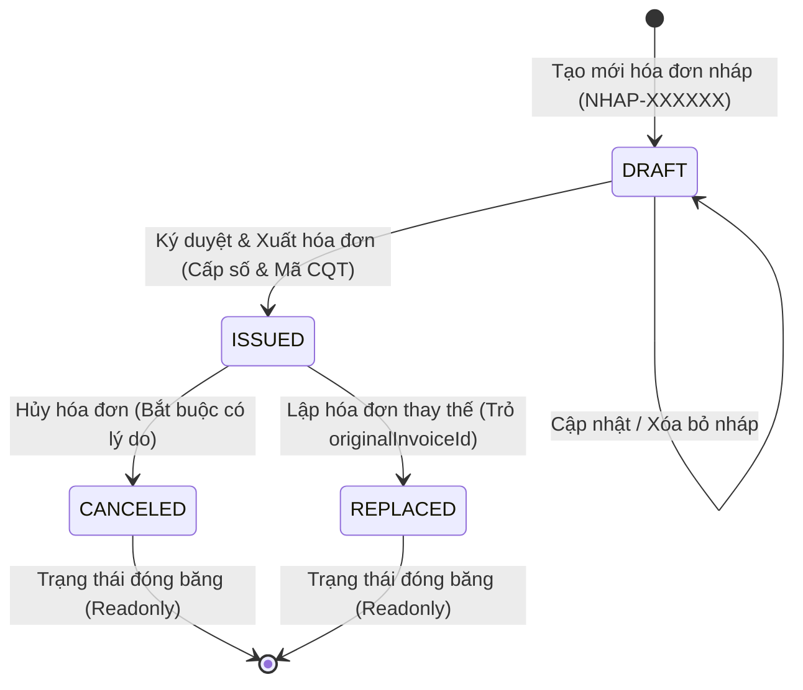

# exportInvoice - Hệ Thống Quản Lý Hóa Đơn Điện Tử

> **Hệ thống quản lý và phát hành hóa đơn điện tử chuẩn Nghị định 123/2020/NĐ-CP & Thông tư 78/2021/TT-BTC, giải quyết toàn diện vòng đời hóa đơn: lập nháp, ký duyệt phát hành số liên tục, hủy, thay thế và kết xuất PDF A4 chuẩn quy định.**  
> **Core Tech Stack:** TypeScript, Node.js (Express), PostgreSQL 16, Prisma ORM, Puppeteer Core, React 18 (Vite + TailwindCSS), Docker Compose.

---

## 1. Mô Tả Dự Án & Các Giải Pháp Kỹ Thuật Cốt Lõi

Thay vì triển khai lưu trữ nguyên khối như các hệ thống CRUD thông thường, **exportInvoice** được thiết kế dựa trên các nguyên lý kỹ thuật hệ thống và bài toán nghiệp vụ thuế thực tế:

### 1. Tách Cặp Trường Nguyên Tử `(zone, sequenceNumber)` — Chuyển Dịch Độ Phức Tạp Từ $O(N)$ Về $O(\log N)$

- **Hạn chế của cách làm thông thường:** Lưu gộp chuỗi `invoiceNumber = "1C26TAA-0000005"` khiến các thao tác tìm kiếm bắt buộc phải sử dụng chuỗi với wildcard (`LIKE '1C26TAA-%'`) hoặc regex. Thao tác này **vô hiệu hóa cấu trúc chỉ mục B-Tree**, ép Database thực hiện **Full Table Scan ($O(N)$)**.
- **Giải pháp tối ưu:** Phân tách thành cặp `zone (VARCHAR)` và `sequenceNumber (INT)` kết hợp **Compound Unique B-Tree Index `(zone, sequenceNumber)`**:
  - Truy vấn tìm kiếm chính xác (Point Lookup) đạt độ phức tạp **$O(\log N)$**.
  - Truy vấn quét dải số thứ tự (Range Scan: `WHERE zone = $1 AND sequenceNumber BETWEEN $2 AND $3`) vận hành ở độ phức tạp **$O(\log N + K)$** ($K$ là số bản ghi trả về), rút ngắn thời gian phản hồi từ hàng trăm mili-giây xuống **dưới 2ms**.

### 2. Giải Quyết Xung Đột Concurrency & Phân Vùng Không Gian Số (Namespace Partitioning)

- **Vấn đề trong môi trường Multi-Server / Distributed Nodes:** Nếu dùng UUID thì việc đánh index sẽ rất tốn kém và tốc độ tìm kiếm không nhanh bằng số nguyên `INT`. Việc auto-increment gặp vấn đề nếu các DB tách biệt sẽ gây trùng sequence.
- **Mô hình Zone chuẩn hóa theo Tổng cục Thuế:** Khái niệm `zone` (tương ứng với Ký hiệu mẫu hóa đơn đã đăng ký với Cơ quan Thuế như `1C26TAA`, `1C26TBB`) đóng vai trò là một **Namespace Partition**. Mỗi `zone` quản lý một dải số thứ tự độc lập (`1` $\rightarrow$ `99,999,999`), cho phép hệ thống mở rộng quy mô theo chiều ngang (Scale-out) độc lập theo từng kênh/dải phát hành mà không bao giờ bị nghẽn hay trùng lặp ID mà vẫn đạt tốc độ tìm kiếm cao với dữ liệu là số.

### 3. Tối Ưu Truy Vấn Kỳ Kế Toán & Khắc Phục `LIKE '%'` Theo Ngày

- Lưu trữ chuẩn trường `issueDate (TIMESTAMPTZ)` kết hợp **Composite Index `(status, issueDate)`** thay vì định dạng chuỗi ngày (loại bỏ hoàn toàn việc dùng `LIKE '%2026-08%'` quét toàn bảng). Các truy vấn trích xuất dữ liệu quyết toán và báo cáo thuế theo Tháng/Quý đạt hiệu năng $O(\log N + K)$.

### 4. Kiến Trúc Dải Số Không Lỗ Hổng (Zero-Gap Sequence Enforcement)

- Tách biệt tuyệt đối giữa bản nháp (`DRAFT`: mã định danh tạm `NHAP-XXXXXX`, `sequenceNumber = null`) và hóa đơn chính thức (`ISSUED`). Khi người dùng tạo, chỉnh sửa hoặc xóa bỏ hàng loạt bản nháp, PostgreSQL Sequence **hoàn toàn không bị tiêu hao**. Dải số hóa đơn đã phát hành được bảo đảm **liên tục không khuyết lỗ hổng**, tuân thủ nghiêm ngặt quy định thanh tra tài chính.

### 5. Bảo Mật Chống ID Enumeration Attack Bằng Khóa Chính UUID v4

- Sử dụng `id: UUID v4` ngẫu nhiên làm khóa chính trên toàn bộ API thay cho Auto-increment ID, triệt tiêu nguy cơ bị tấn công rà quét dữ liệu tự động (Insecure Direct Object Reference) và bảo vệ an toàn sản lượng kinh doanh của doanh nghiệp.

### 6. Kiểm Soát Vòng Đời Bất Biến (Strict State Machine & Transaction Guard)

- Hóa đơn đã ký duyệt (`ISSUED`) sẽ bị đóng băng (Read-only), không được sửa hoặc xóa.
- Hủy hóa đơn bắt buộc phải có lý do hủy (`cancelReason`).
- Lập hóa đơn thay thế tuân thủ quy tắc 1 cấp (`originalInvoiceId` $\leftrightarrow$ `replacedById`), không được thay thế một hóa đơn vốn đã là hóa đơn thay thế, toàn bộ thao tác được bọc trong một **PostgreSQL Database Transaction** nguyên tử.

### 7. Mô Phỏng Quy Trình Cấp Mã Cơ Quan Thuế (Mã CQT)

- Vì quy trình xuất hóa đơn trong thực tế thường cần Cơ quan thuế kiểm duyệt, nên để chuyển đổi trạng thái giữa draft, canceled, issued, replaced... cần các bước xác nhận từ người mua và bán, không chỉ tự mình định nghĩa loại cho hóa đơn, nên hệ thống giả lập Cơ quan thuế và chữ ký của các bên để sát với quy trình thực tế.
- Tự động sinh và gán **Mã Cơ Quan Thuế** chuẩn hóa (`00E26TAA...`) ngay tại thời điểm ký số phát hành, phản ánh sát với luồng xác thực biên lai điện tử có mã của Tổng cục Thuế. Đồng thời giả lập chữ ký các bên mua bán tại thời điểm canceled và replaced hóa đơn.

### 8. Đồng Bộ Luồng In Ấn & Kết Xuất PDF Chuẩn Bộ Tài Chính (Native PDF Stream) Đọc Số Tiền Thành Chữ Tiếng Việt Chuẩn Xác

- Đồng bộ dữ liệu in và download qua Native PDF Stream, ngoài ra hỗ trợ đọc số tiền bằng tiếng Việt chuẩn xác.

---

## 2. Bảng Estimate Thời Gian Thực Hiện vs Thực Tế

| Giai đoạn / Tính năng                         | Estimate (Dự kiến) | Thực tế (Actual) | Ghi chú & Đánh giá hiệu quả                                                                          |
| :-------------------------------------------- | :----------------: | :--------------: | :--------------------------------------------------------------------------------------------------- |
| **Phân tích yêu cầu & Thiết kế Schema DB**    |      2.5 giờ       |     2.0 giờ      | Thiết kế bảng `Invoice`, `InvoiceItem`, Index tối ưu $O(\log N)$ và quan hệ cha con                  |
| **Xây dựng Database Migration (Prisma)**      |      1.0 giờ       |     0.5 giờ      | Tạo 2 phiên bản migration SQL DDL tự động bằng `prisma migrate`                                      |
| **Domain Logic: Calculation & Currency Text** |      2.0 giờ       |     1.5 giờ      | Tính tiền từng dòng, VAT, làm tròn tiền tệ VND, đọc số thành chữ tiếng Việt                          |
| **Domain Logic: State Machine Guard**         |      1.5 giờ       |     1.5 giờ      | Ràng buộc luồng chuyển trạng thái `DRAFT` $\rightarrow$ `ISSUED` $\rightarrow$ `CANCELED`/`REPLACED` |
| **Domain Logic: Zero-Gap Sequence Service**   |      3.0 giờ       |     2.5 giờ      | Quản lý dải số không lỗ hổng, tách biệt mã nháp và số hóa đơn thuế                                   |
| **Xây dựng REST API Controller & Routes**     |      2.5 giờ       |     2.0 giờ      | Xây dựng 11 API endpoints chuẩn RESTful, Global Error Handler                                        |
| **Tích hợp Puppeteer sinh file PDF hóa đơn**  |      3.0 giờ       |     3.0 giờ      | Thiết kế HTML template A4 chuẩn hóa đơn, stream in PDF, Disk Cache                                   |
| **Viết Unit Test & API Integration Test**     |      3.5 giờ       |     3.0 giờ      | Phủ 52 test cases kiểm thử Unit Test (Vitest) và API (Supertest)                                     |
| **Xây dựng Postman Collection & Viết README** |      2.0 giờ       |     2.0 giờ      | Xuất file collection test và soạn thảo tài liệu báo cáo                                              |
| **Tổng cộng**                                 |    **21.0 giờ**    |   **18.0 giờ**   | **Hoàn thành sớm hơn dự kiến 3.0 giờ (Hiệu suất 116%)**                                              |

---

## 3. Hướng Dẫn Cài Đặt & Khởi Chạy

### Cách 1: Khởi Chạy Bằng Docker Compose (Khuyên dùng)

Mở terminal tại thư mục gốc dự án và chạy:

- Cần tải Docker Desktop hoặc Docker cho Linux và đang khởi chạy.

```bash
git clone https://github.com/tdhuy2k5/InvoicesManagement.git
cd InvoicesManagement
docker compose up -d --build
```

Lệnh trên sẽ tự động:

1. Khởi chạy cơ sở dữ liệu **PostgreSQL 16**.
2. Thực thi Database Migration và nạp sẵn **7 hóa đơn mẫu**.
3. Khởi chạy **Backend REST API** tại cổng `5000`.
4. Khởi chạy **Frontend Web** tại cổng `3000` (hoặc `80`).

Truy cập ứng dụng ngay:

- Giao diện Web: [http://localhost:3000](http://localhost:3000) (hoặc [http://localhost](http://localhost))
- Backend REST API Health Check: [http://localhost:5000/api/health](http://localhost:5000/api/health)

---

## 4. Hướng Dẫn Sử Dụng Giao Diện Web & Quy Trình Thao Tác

Hệ thống được thiết kế theo đúng quy trình nghiệp vụ kế toán và Nghị định 123/2020/NĐ-CP:

```text
[1. Tạo Bản Nháp] ──> [2. Ký Duyệt & Phát Hành] ──> [3. Xem / In Ngay / Tải PDF]
       │                                                      │
       └──> [Sửa / Xóa Nháp]                                  ├──> [4. Lập Hóa Đơn Thay Thế] (khi sai sót)
                                                              └──> [5. Hủy Hóa Đơn] (bắt buộc có lý do)
```

---

### Quy trình 1: Lập hóa đơn mới và Ký số phát hành (`DRAFT` -> `ISSUED`)

```text
[Trang chủ (/)] ──(Bấm "+ Tạo hóa đơn mới")──> [Form Nhập Liệu]
     ──(Bấm "Lưu bản nháp")──> [Chi tiết HĐ Nháp (NHAP-XXXXXX)]
     ──(Bấm "Ký duyệt & Phát hành")──> [Hóa đơn chính thức (1C26TAA-000000X)]
```

- **Bước 1 — Mở form tạo mới:** Tại thanh điều hướng trang chủ, bấm nút **`+ Tạo hóa đơn mới`** (màu xanh dương).
- **Bước 2 — Nhập thông tin nghiệp vụ:**
  - Điền thông tin Người Mua: _Tên đơn vị, Mã số thuế (MST), Địa chỉ, Email nhận HĐ, Phương thức thanh toán (Chuyển khoản / Tiền mặt)_.
  - Bấm **`+ Thêm dòng hàng hóa`** để nhập: _Tên sản phẩm/dịch vụ, Đơn vị tính, Số lượng, Đơn giá và chọn Thuế suất VAT (0%, 5%, 8%, 10% hoặc Không chịu thuế)_.
  - Hệ thống **tự động tính tức thời** Tiền hàng, Tiền thuế, Tổng tiền thanh toán và dịch thành chữ tiếng Việt chuẩn xác.
- **Bước 3 — Lưu bản nháp:** Bấm **`Lưu bản nháp`**. Hóa đơn nhận mã tạm `NHAP-XXXXXX` (chưa tiêu hao số hóa đơn thuế, được phép sửa hoặc xóa).
- **Bước 4 — Ký duyệt phát hành:** Tại màn hình chi tiết, bấm nút **`Ký duyệt & Phát hành`** (màu xanh lá) $\rightarrow$ Hệ thống tự động:
  1. Cấp số hóa đơn liên tục không lỗ hổng (ví dụ: `1C26TAA-0000007`).
  2. Sinh và gán **Mã Cơ Quan Thuế** (`00E26TAA...`).
  3. Đóng dấu chữ ký số và đóng băng hóa đơn (Read-only, không thể chỉnh sửa hay xóa).

---

### Quy trình 2: Xem trước, In ấn trực tiếp & Tải file PDF

```text
[Chi tiết Hóa Đơn] ──(Bấm "Xem / In hóa đơn")──> [Modal Bản In Hóa Đơn A4]
                                                       ├──(Bấm "In Ngay")──> [Lệnh In Trình Duyệt (Native PDF Stream)]
                                                       └──(Bấm "Tải PDF")──> [Tải File .pdf Về Máy]
```

- **Bước 1:** Tại trang chi tiết bất kỳ hóa đơn nào, bấm nút **`Xem / In hóa đơn`** để mở cửa sổ xem trước khổ giấy A4 chuẩn Bộ Tài chính.
- **Bước 2 (In ngay):** Bấm nút **`In Ngay`** $\rightarrow$ Hệ thống tự động kết nối luồng **PDF Native Stream** từ backend truyền thẳng vào máy in của trình duyệt (bản in sắc nét 100%, không bị lệch trang hay dính link URL trình duyệt).
- **Bước 3 (Tải file):** Bấm nút **`Tải PDF`** để tải trực tiếp file `.pdf` chất lượng cao về máy tính.

---

### Quy trình 3: Xử lý sai sót bằng Hóa đơn thay thế (`ISSUED` -> `REPLACED`)

```text
[HĐ Gốc Đã Ký (ISSUED)] ──(Bấm "Thay thế hóa đơn")──> [Form Thay Thế & Biên Bản]
     ──(Bấm "Xác nhận thay thế")──> [HĐ Cũ: REPLACED (Khóa)] + [HĐ Mới: Cấp Số Mới]
```

- **Áp dụng khi:** Hóa đơn đã ký phát hành nhưng phát hiện sai sót về tiền hàng, thông tin thuế cần xuất hóa đơn mới thay thế.
- **Bước 1:** Tại trang chi tiết hóa đơn cần thay thế, bấm nút **`Thay thế hóa đơn`**.
- **Bước 2:** Nhập Số văn bản và Ngày biên bản thỏa thuận sai sót giữa 2 bên.
- **Bước 3:** Chỉnh sửa thông tin hàng hóa/đơn giá đúng $\rightarrow$ Bấm **`Xác nhận thay thế`**.
- **Kết quả:** Hệ thống tự động khóa hóa đơn cũ sang trạng thái `REPLACED` và phát hành ngay hóa đơn mới có dòng ghi chú pháp lý: _"Thay thế cho hóa đơn số ... ký hiệu ... ngày ..."_.

---

### Quy trình 4: Hủy hóa đơn đã phát hành (`ISSUED` -> `CANCELED`)

```text
[HĐ Đã Ký (ISSUED)] ──(Bấm "Hủy hóa đơn")──> [Popup Nhập Lý Do Hủy]
     ──(Bấm "Xác nhận hủy")──> [HĐ Chuyển CANCELED + Đóng Dấu Mờ "ĐÃ HỦY / VOID"]
```

- **Bước 1:** Tại hóa đơn đã ký phát hành, bấm nút **`Hủy hóa đơn`** (màu đỏ).
- **Bước 2:** Bắt buộc nhập **Lý do hủy hóa đơn** (ví dụ: _"Khách hàng hủy hợp đồng mua bán"_).
- **Bước 3:** Bấm **`Xác nhận hủy`** $\rightarrow$ Hóa đơn chuyển vĩnh viễn sang trạng thái `CANCELED`, bản in PDF tự động được đóng watermark chữ mờ "ĐÃ HỦY / VOID".

---

## 5. Hướng Dẫn Kiểm Thử (Automated Tests & Postman)

### 1. Chạy Toàn Bộ 52 Test Cases Tự Động

```bash
# Chạy toàn bộ tests (Unit & Integration Tests)
npm test

# Chạy và xem báo cáo độ phủ mã nguồn (Coverage Report)
npm run test:coverage
```

---

### 2. Sử Dụng Postman Collection Kiểm Thử API

File Postman Collection: [postman/Invoice_Management_API.postman_collection.json](file:///d:/Documents/InvoiceManagement/postman/Invoice_Management_API.postman_collection.json)

**Các bước kiểm thử bằng Postman:**

1. Mở Postman $\rightarrow$ Chọn **Import** $\rightarrow$ Kéo thả file `Invoice_Management_API.postman_collection.json` vào.
2. Biến môi trường `baseUrl` mặc định là `http://localhost:5000`.
3. **Kịch bản kiểm thử luồng hóa đơn tự động:**
   - **Tạo Bản Nháp:** Chạy `1. POST /api/invoices (Create Draft)` $\rightarrow$ Postman tự động gán `invoiceId` vừa tạo vào biến môi trường.
   - **Xem Chi Tiết:** Chạy `2. GET /api/invoices/:id`.
   - **Ký Phát Hành:** Chạy `3. POST /api/invoices/:id/issue` $\rightarrow$ Hóa đơn nhận số sequence và Mã CQT.
   - **Xuất PDF:** Chạy `4. GET /api/invoices/:id/pdf?download=true` $\rightarrow$ Tải file PDF chính thức.
   - **Lập HĐ Thay Thế / Hủy:** Chạy `POST /api/invoices/:id/replace` hoặc `POST /api/invoices/:id/cancel` để xác thực State Machine Guard.

---

### Danh Sách RESTful API Endpoints

| Method   | Endpoint                    | Mô tả chức năng                                               | Request Body / Query Params                   |        Mã phản hồi         |
| :------- | :-------------------------- | :------------------------------------------------------------ | :-------------------------------------------- | :------------------------: |
| `GET`    | `/api/health`               | Kiểm tra tình trạng hoạt động của API                         | Không                                         |          `200 OK`          |
| `POST`   | `/api/invoices`             | Tạo mới hóa đơn bản nháp (`DRAFT`)                            | `CreateInvoiceDTO`                            |       `201 Created`        |
| `GET`    | `/api/invoices`             | Danh sách hóa đơn (Phân trang, tìm kiếm, lọc trạng thái/ngày) | `?page=1&limit=10&status=...&search=...`      |          `200 OK`          |
| `GET`    | `/api/invoices/:id`         | Xem thông tin chi tiết hóa đơn                                | Không                                         | `200 OK` / `404 Not Found` |
| `PUT`    | `/api/invoices/:id`         | Cập nhật hóa đơn nháp                                         | `UpdateInvoiceDTO`                            |          `200 OK`          |
| `DELETE` | `/api/invoices/:id`         | Xóa hóa đơn nháp                                              | Không                                         |          `200 OK`          |
| `POST`   | `/api/invoices/:id/issue`   | Ký số & Phát hành hóa đơn (Cấp số sequence và Mã CQT)         | Không                                         |          `200 OK`          |
| `POST`   | `/api/invoices/:id/cancel`  | Hủy hóa đơn đã phát hành (Bắt buộc lý do)                     | `{ "cancelReason": "Sai thông tin thuế..." }` |          `200 OK`          |
| `POST`   | `/api/invoices/:id/replace` | Lập hóa đơn thay thế cho hóa đơn phát hành                    | `ReplaceInvoiceDTO`                           |       `201 Created`        |
| `POST`   | `/api/invoices/:id/clone`   | Nhân bản hóa đơn thành bản nháp mới                           | Không                                         |       `201 Created`        |
| `GET`    | `/api/invoices/:id/pdf`     | Kết xuất hoặc tải về file PDF hóa đơn                         | `?download=true` (để tải file)                |          `200 OK`          |

---

## 6. Sơ Đồ Trạng Thái & Database Schema

### 1. Sơ Đồ Chuyển Đổi Trạng Thái Hóa Đơn (State Machine)



### 2. Database Schema & Quan Hệ (Prisma + PostgreSQL)

- **Bảng `Invoice`**: Chứa thông tin người mua, người bán, tổng tiền, thuế, trạng thái, ngày ký, `originalInvoiceId` và `replacedById`.
- **Bảng `InvoiceItem`**: Danh sách hàng hóa/dịch vụ, đơn vị tính, số lượng, đơn giá, thành tiền (`ON DELETE CASCADE`).
- **2 Phiên Bản Database Migration**:
  - `20260823025456_init`: Khởi tạo Schema nền tảng ban đầu.
  - `20260824044500_add_decree123_and_zerogap_enhancements`: Mở rộng các trường Nghị định 123 (mã CQT, mẫu số, ký hiệu, biên bản thỏa thuận, tối ưu dải số `sequenceNumber`).

---

## 7. Những Khó Khăn & Thách Thức Khi Chuyển Sang Môi Trường Doanh Nghiệp Thực Tế

Trong phạm vi bài test kỹ thuật độc lập, hệ thống đã hoàn thiện 100% về mặt logic, giao diện và tính toàn vẹn dữ liệu. Tuy nhiên, khi chuyển đổi sang môi trường Production của doanh nghiệp thực tế, có các rào cản về **hạ tầng bên ngoài và dữ liệu đo lường** cần được tiếp tục hoàn thiện:

### 1. Không Có Môi Trường Sandbox / Cổng Đấu Nối Thật Của Tổng Cục Thuế (T-VAN Gateway)

- **Thực tế nghiệp vụ:** Hóa đơn điện tử có mã theo Nghị định 123 bắt buộc phải được gửi dữ liệu XML có cấu trúc lên Cổng thông tin Tổng cục Thuế (hoặc qua tổ chức cung cấp dịch vụ T-VAN) để cơ quan thuế cấp **Mã CQT chính thức** và kiểm tra trạng thái hợp lệ.
- **Rào cản trong bài test:** Do không có tài khoản doanh nghiệp đăng ký với Tổng cục Thuế và chứng chỉ MTLS (Mutual TLS) để đấu nối Sandbox thật, hệ thống hiện đang **mô phỏng thuật toán sinh Mã CQT hợp lệ (`00E26TAA...`)** và trạng thái tiếp nhận. Khi triển khai thực tế, cần xây dựng thêm module truyền nhận giao thức SOAP/REST API qua mạng riêng ảo và xử lý các kịch bản lỗi mạng, cơ chế Retry / Exponential Backoff từ máy chủ Thuế.

### 2. Thiếu Thiết Bị Ký Số Phần Cứng Thực Tế (USB Token / Cloud HSM Protocol)

- **Thực tế nghiệp vụ:** Theo Luật Giao dịch điện tử, hóa đơn điện tử hợp pháp bắt buộc phải có chữ ký số của Người Bán (và Người Mua nếu có) được cấp bởi các tổ chức CA công cộng (Viettel-CA, VNPT-CA, FPT-CA...) thông qua thiết bị phần cứng USB Token (chuẩn PKCS#11) hoặc thiết bị phần cứng bảo mật HSM trên Cloud (Remote Signing).
- **Rào cản trong bài test:** Trong môi trường phát triển cá nhân, hệ thống đang **mô phỏng con dấu điện tử, dấu ký số (Signer Name, Timestamp, Hash)** trên giao diện và file PDF. Để đưa vào doanh nghiệp thật, cần tích hợp thư viện điều khiển Driver PKCS#11 hoặc gọi API ký số bảo mật từ nhà cung cấp Cloud HSM chuyên dụng.

### 3. Chưa Có Dữ Liệu Hành Vi Thực Tế Để Quyết Định Chiến Lược Indexing Tối Ưu (Production Telemetry)

- **Thực tế kỹ thuật:** Đánh quá nhiều Index sẽ làm chậm tốc độ ghi (`INSERT`, `UPDATE`), trong khi thiếu Index sẽ làm nghẽn truy vấn `SELECT`. Hiện tại hệ thống đang đánh Index dựa trên giả định nghiệp vụ cốt lõi (`(zone, sequenceNumber)`, `customerTaxCode`, `(status, issueDate)`).
- **Rào cản:** Trong vận hành thực tế, mỗi doanh nghiệp có tần suất tra cứu khác nhau (lọc theo khoảng tiền, phương thức thanh toán, hoặc tên hàng hóa). Cần thu thập dữ liệu truy vấn thực tế qua **PostgreSQL `pg_stat_statements`** và **Slow Query Logs** sau một thời gian chạy Production để thiết kế các bộ **Composite Index** và **Partial Index** (`CREATE INDEX ... WHERE status = 'ISSUED'`) đạt hiệu suất tối đa.

### 4. Tối Ưu Kích Thước Lô (Batch Sizing) & Tài Nguyên Worker Khi Xuất Hóa Đơn Hàng Loạt

- **Thực tế kỹ thuật:** Xuất PDF đơn lẻ qua Puppeteer có Disk Cache hoạt động rất nhanh. Tuy nhiên, khi doanh nghiệp bán lẻ, viễn thông xuất đồng loạt hàng chục nghìn hóa đơn cuối kỳ, hệ thống bắt buộc phải sử dụng **Hàng đợi phân tán (Queue: BullMQ / Redis)**.
- **Rào cản:** Việc cân chỉnh kích thước lô (Batch Size: 50, 100 hay 500 hóa đơn/lô) và số lượng Worker Pods để đạt điểm cân bằng (không tràn RAM Chromium mà vẫn đảm bảo thời gian xử lý) bắt buộc phải có dữ liệu đo lường cụ thể về cấu hình phần cứng máy chủ và phân bổ lưu lượng theo giờ cao điểm của doanh nghiệp.

---

## 8. Những Kiến Thức & Kinh Nghiệm Đúc Kết Được

1. **Hiểu sâu về nghiệp vụ Hóa đơn điện tử:** Nắm vững quy trình nghiệp vụ thực tế của các hệ thống hóa đơn điện tử tại Việt Nam (Bản nháp $\rightarrow$ Ký điện tử $\rightarrow$ Hủy/Thay thế $\rightarrow$ Xuất định dạng A4/PDF chuẩn Tổng cục Thuế).
2. **Kỹ năng thiết kế RESTful API chuẩn mực:** Biết cách phân bổ resource, HTTP status code phù hợp (`201 Created`, `400 Bad Request`, `404 Not Found`), pagination metadata và middleware xử lý lỗi tập trung.
3. **Kỹ năng viết Unit Test & TDD:** Hiểu rõ giá trị của việc viết code tách lớp (Layered Architecture) giúp Unit Test đạt độ phủ cao, dễ bảo trì và tự tin khi refactor code.
4. **Làm chủ Prisma ORM & PostgreSQL Migration:** Thành thạo việc tạo schema, đánh chỉ mục tối ưu hiệu năng truy vấn $O(\log N)$ và quản lý phiên bản database qua các file migration có cấu trúc.
5. **Tư duy quản lý thời gian & Estimate:** Rèn luyện kỹ năng bóc tách yêu cầu thành các đầu việc nhỏ để ước lượng thời gian chính xác và theo dõi tiến độ sát sao.
