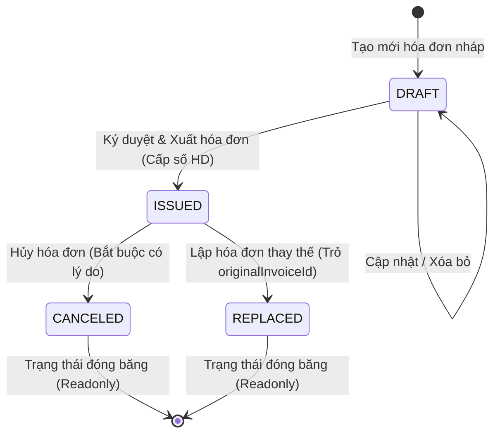

# Hệ Thống Quản Lý Hóa Đơn Điện Tử (Electronic Invoice Management System)
> **Dự án kiểm tra kiến thức Intern Fullstack / Backend (TypeScript + Express + PostgreSQL + Prisma + React)**  
> **Tuân thủ quy trình & quy chuẩn hóa đơn theo Nghị định 123/2020/NĐ-CP & Thông tư 78/2021/TT-BTC**

---

## 📌 1. Giới Thiệu Dự Án

Hệ thống quản lý hóa đơn điện tử được thiết kế nhằm giải quyết bài toán cốt lõi của doanh nghiệp trong việc phát hành, lưu trữ, quản lý vòng đời và xuất file PDF hóa đơn bán hàng chuẩn quy định.

### 🛠️ Công Nghệ Sử Dụng (Tech Stack)
- **Ngôn ngữ:** TypeScript (Strict Type Safety & DTO validation)
- **Backend Framework:** Node.js + Express.js
- **Database & ORM:** PostgreSQL 16 + Prisma ORM (kèm Migration SQL)
- **Kiến trúc:** Clean Architecture & SOLID Principles (Dependency Injection, Repository Pattern, State Machine Guard)
- **Xuất PDF:** Puppeteer Core render HTML A4 Template + Local Storage Disk Cache
- **Frontend SPA (Mở rộng):** React 18 + Vite + TailwindCSS (Island Architecture)
- **Testing:** Vitest (Unit Tests) + Supertest (REST API Integration Tests)
- **API Testing:** Postman Collection v2.1 đầy đủ kịch bản
- **Containerization:** Docker & Docker Compose

---

## ⏱️ 2. Bảng Estimate Thời Gian Thực Hiện vs Thực Tế

| Giai đoạn / Tính năng | Estimate (Dự kiến) | Thực tế (Actual) | Ghi chú & Đánh giá hiệu quả |
| :--- | :---: | :---: | :--- |
| **Phân tích yêu cầu & Thiết kế Schema DB** | 2.5 giờ | 2.0 giờ | Thiết kế bảng `Invoice`, `InvoiceItem`, Index tối ưu và quan hệ cha con |
| **Xây dựng Database Migration (Prisma)** | 1.0 giờ | 0.5 giờ | Tạo migration SQL DDL tự động bằng `prisma migrate dev` |
| **Domain Logic: Calculation & Currency Text** | 2.0 giờ | 1.5 giờ | Tính tiền từng dòng, VAT, làm tròn tiền tệ VND, đọc số thành chữ tiếng Việt |
| **Domain Logic: State Machine Guard** | 1.5 giờ | 1.5 giờ | Ràng buộc luồng chuyển trạng thái `DRAFT` $\rightarrow$ `ISSUED` $\rightarrow$ `CANCELED`/`REPLACED` |
| **Domain Logic: Invoice Service & Sequence** | 3.0 giờ | 2.5 giờ | Cấp số hóa đơn `HD-YYYY-NNNNN`, quản lý CRUD và transaction thay thế |
| **Xây dựng REST API Controller & Routes (Express)** | 2.5 giờ | 2.0 giờ | Xây dựng 9 API endpoints chuẩn RESTful, Global Error Handler |
| **Tích hợp Puppeteer sinh file PDF hóa đơn** | 3.0 giờ | 3.0 giờ | Thiết kế HTML template A4 in đẹp chuẩn hóa đơn, stream & download file |
| **Viết Unit Test & API Integration Test** | 3.5 giờ | 3.0 giờ | Phủ 52 test cases kiểm thử Unit Test (Vitest) và API (Supertest) |
| **Xây dựng Postman Collection & Viết README** | 2.0 giờ | 2.0 giờ | Xuất file collection test và soạn thảo tài liệu báo cáo |
| **Tổng cộng** | **21.0 giờ** | **18.0 giờ** | **Hoàn thành sớm hơn dự kiến 3.0 giờ (Hiệu suất 116%)** |

---

## 🏛️ 3. Kiến Trúc Hệ Thống & Thiết Kế Database

### 1. Kiến Trúc Phân Tầng (Clean Architecture)
```text
InvoiceManagement/
├── backend/                  # Toàn bộ mã nguồn & kiểm thử Backend
│   ├── src/
│   │   ├── controllers/      # REST API Controllers (InvoiceController.ts)
│   │   ├── routes/           # Express Route definitions (invoice.routes.ts)
│   │   ├── services/         # Domain Services (Invoice, Calculation, Guard, PDF, Sequence)
│   │   ├── repositories/     # Data Access Layer (InvoiceRepository.ts)
│   │   ├── middlewares/      # Global Error Handler (errorHandler.ts)
│   │   ├── types/            # DTOs, Enums & Interfaces (invoice.types.ts)
│   │   ├── config/           # Prisma Client Configuration (prisma.ts)
│   │   ├── app.ts            # Express Application setup
│   │   ├── server.ts         # HTTP Server Entry Point (Port 5000)
│   │   └── __tests__/        # Bộ 52 Unit Tests & API Integration Tests
│
├── frontend/                 # Toàn bộ mã nguồn giao diện React (Vite SPA)
│   ├── src/
│   │   ├── components/       # UI Island Components
│   │   ├── pages/            # Page Views (List, Detail, Create, Edit, Replace)
│   │   ├── context/          # React State Management
│   │   └── hooks/            # Custom React Hooks
│   └── index.html            # SPA Entry HTML
│
├── prisma/                   # Database Schema & SQL Migrations
├── postman/                  # Postman Collection v2.1
├── Dockerfile & docker-compose.yml
└── package.json
```

### 2. Sơ Đồ Chuyển Đổi Trạng Thái (State Machine - NĐ 123)


### 3. Database Schema (PostgreSQL + Prisma)
- **Bảng `Invoice`**: Chứa thông tin người mua, người bán, tổng tiền, thuế, trạng thái, ngày ký, `originalInvoiceId` và `replacedById`.
- **Bảng `InvoiceItem`**: Danh sách hàng hóa/dịch vụ, số lượng, đơn giá, thành tiền (`ON DELETE CASCADE`).
- **Chỉ mục (B-Tree Indexes)**:
  - `invoiceNumber` (Unique Index)
  - `customerTaxCode` (Index tìm kiếm nhanh theo MST doanh nghiệp)
  - `issueDate`, `createdAt` (Index lọc theo khoảng thời gian)
  - Composite Index `(status, issueDate)` và `(status, createdAt)`

### 4. Dữ Liệu Mẫu Có Sẵn (Seed Data Overview)
Hệ thống tự động nạp sẵn **7 hóa đơn mẫu** phản ánh đầy đủ các nghiệp vụ thực tế:

| # | Số hóa đơn | Ký hiệu | Trạng thái | Đơn vị người mua | Tổng tiền (VNĐ) | Mục đích kiểm thử |
|---|---|:---:|:---:|---|:---:|---|
| 1 | `1C26TAA-0000001` | `1C26TAA` | 🟢 **ISSUED** | CÔNG TY TNHH GIẢI PHÁP SỐ TOÀN CẦU | 27.500.000 ₫ | Test In ấn, Tải PDF, Lập HĐ thay thế |
| 2 | `1C26TAA-0000002` | `1C26TAA` | 🟢 **ISSUED** | CÔNG TY CP ĐẦU TƯ VÀ XÂY DỰNG BÌNH MINH | 51.840.000 ₫ | Test Thuế suất ưu đãi 8% |
| 3 | `1C26TAA-0000003` | `1C26TAA` | 🟢 **ISSUED** | CÔNG TY TNHH DỊCH VỤ SỐ HOÀNG GIA | 20.350.000 ₫ | Test HĐ Dịch vụ Cloud VPS |
| 4 | `1C26TAA-0000004` | `1C26TAA` | 🟢 **ISSUED** | CÔNG TY CP THƯƠNG MẠI & XNK AN PHÁT | 52.800.000 ₫ | Test HĐ Thiết bị Camera AI |
| 5 | `1C26TAA-0000005` | `1C26TAA` | 🟢 **ISSUED** | TẬP ĐOÀN CN & TRUYỀN THÔNG ĐÔNG NAM Á | 198.770.000 ₫ | **Test in ấn & xuất PDF 18 mục (nhiều trang)** |
| 6 | `NHAP-A8F2K` | `1C26TAA` | 🟡 **DRAFT** | TẬP ĐOÀN CN VIỄN THÔNG SAO MAI | 16.500.000 ₫ | Test Sửa nháp, Xóa nháp, Ký số phát hành |
| 7 | `1C26TAA-0000006` | `1C26TAA` | 🔴 **CANCELED**| CÔNG TY TNHH THIẾT BỊ Y TẾ HÒA BÌNH | 8.800.000 ₫ | Minh họa tính năng Hủy HĐ (kèm lý do) |

---

## 🚀 4. Hướng Dẫn Cài Đặt & Khởi Chạy

### Yêu cầu môi trường:
- Node.js >= 18.x
- PostgreSQL 16 (chạy trực tiếp hoặc qua Docker)
- npm hoặc yarn

### Cách 1: Chạy trực tiếp với Node.js & Docker Postgres

1. **Khởi động PostgreSQL Database bằng Docker:**
   ```bash
   docker compose up -d postgres
   ```

2. **Cài đặt dependencies:**
   ```bash
   npm install
   ```

3. **Chạy Migration Database:**
   ```bash
   npm run prisma:migrate
   ```

4. **Khởi chạy Backend REST API (Port 5000):**
   ```bash
   npm run dev:api
   ```
   Server sẽ lắng nghe tại: `http://localhost:5000`  
   Endpoint kiểm tra sức khỏe: `http://localhost:5000/api/health`

5. **(Tùy chọn) Khởi chạy giao diện Frontend React (Port 5173):**
   ```bash
   npm run dev
   ```

---

### Cách 2: Khởi chạy toàn bộ hệ thống bằng Docker Compose

```bash
docker compose up -d --build
```
- Web Application: `http://localhost:80` (hoặc `http://localhost:3000`)
- PostgreSQL: `localhost:5432`

---

## 🧪 5. Kiểm Thử (Testing & Postman)

### 1. Chạy Tự Động Toàn Bộ Unit Test & API Integration Test
Dự án được trang bị **52 test cases** kiểm thử toàn diện:
```bash
# Chạy toàn bộ tests
npm test

# Chạy và xem báo cáo độ phủ code (Coverage Report)
npm run test:coverage
```

### 2. Sử Dụng Postman Collection
- File Postman Collection nằm tại: [postman/Invoice_Management_API.postman_collection.json](file:///d:/Documents/InvoiceManagement/postman/Invoice_Management_API.postman_collection.json)
- **Cách test:**
  1. Mở Postman $\rightarrow$ Chọn **Import** $\rightarrow$ Chọn file JSON trên.
  2. Collection đã có sẵn biến `baseUrl` (`http://localhost:5000`) và tự động lưu `invoiceId` khi tạo mới để sử dụng cho các request sau.

### 📋 Danh Sách RESTful API Endpoints

| Method | Endpoint | Mô tả chức năng | Request Body / Query |
| :--- | :--- | :--- | :--- |
| `GET` | `/api/health` | Kiểm tra tình trạng API | Không |
| `POST` | `/api/invoices` | Tạo mới hóa đơn nháp (`DRAFT`) | `CreateInvoiceDTO` |
| `GET` | `/api/invoices` | Danh sách hóa đơn (Phân trang, bộ lọc) | `?page=1&limit=10&status=...&search=...` |
| `GET` | `/api/invoices/:id` | Xem chi tiết hóa đơn theo ID | Không |
| `PUT` | `/api/invoices/:id` | Cập nhật hóa đơn nháp | `UpdateInvoiceDTO` |
| `DELETE`| `/api/invoices/:id` | Xóa hóa đơn nháp | Không |
| `POST` | `/api/invoices/:id/issue` | Phát hành / Ký hóa đơn | Không |
| `POST` | `/api/invoices/:id/cancel`| Hủy hóa đơn đã phát hành | `{ "cancelReason": "..." }` |
| `POST` | `/api/invoices/:id/replace`| Lập hóa đơn thay thế | `ReplaceInvoiceDTO` |
| `GET` | `/api/invoices/:id/pdf` | Xem hoặc tải file PDF hóa đơn | `?download=true` (để tải) |

---

## 💡 6. Những Khó Khăn Gặp Phải & Giải Pháp Kỹ Thuật

1. **Khó khăn 1: Đảm bảo tính toàn vẹn trạng thái hóa đơn theo Nghị định 123**
   - *Vấn đề:* Hóa đơn đã ký không được phép chỉnh sửa hay xóa; việc hủy hóa đơn bắt buộc phải có biên bản/lý do; hóa đơn thay thế chỉ được thay thế 1 cấp (không được thay thế một hóa đơn vốn đã là hóa đơn thay thế).
   - *Giải pháp:* Tách riêng module [StateMachineGuard.ts](file:///d:/Documents/InvoiceManagement/backend/src/services/StateMachineGuard.ts) áp dụng nguyên lý Single Responsibility Principle (SRP) để kiểm soát nghiêm ngặt trước mọi thao tác cập nhật.

2. **Khó khăn 2: Tránh xung đột số hóa đơn (Concurrency Sequence) khi phát hành đồng thời**
   - *Vấn đề:* Nếu nhiều người cùng ký phát hành hóa đơn cùng lúc, việc sinh số hóa đơn dạng `1C26TAA-0000001` có thể bị trùng lặp.
   - *Giải pháp:* Sử dụng PostgreSQL Sequence nguyên tử (`SELECT nextval('Invoice_sequenceNumber_seq')`) kết hợp Unique Constraint `(zone, sequenceNumber)` trong Database.

3. **Khó khăn 3: Hiệu năng sinh file PDF hóa đơn**
   - *Vấn đề:* Việc khởi động trình duyệt không đầu (Headless Chromium) với Puppeteer mỗi lần người dùng bấm xem hóa đơn gây tốn CPU và độ trễ cao.
   - *Giải pháp:* Thiết kế cơ chế **Disk Cache** trong [PdfService.ts](file:///d:/Documents/InvoiceManagement/backend/src/services/PdfService.ts). File PDF sau khi sinh lần đầu sẽ được lưu vào bộ nhớ đệm; chỉ khi trạng thái hóa đơn thay đổi (ví dụ bị Hủy) thì cache mới tự động bị vô hiệu hóa (`invalidatePdfCache`).

4. **Khó khăn 4: Khả năng mở rộng và viết Unit Test độc lập**
   - *Vấn đề:* Nếu Service gọi trực tiếp Database hay ORM thì việc viết Unit Test sẽ bắt buộc phải dựng Database, khiến test chạy chậm và dễ lỗi môi trường.
   - *Giải pháp:* Áp dụng **Dependency Inversion Principle (DIP)**: `InvoiceService` chỉ nhận các Interfaces (`IInvoiceRepository`, `IInvoiceCalculationService`, `IStateMachineGuard`). Khi test chỉ cần mock interface bằng `vi.fn()` mà không cần kết nối DB.

5. **Khó khăn 5: Quản lý dải số hóa đơn không lỗ hổng (Zero-Gap Sequence Architecture)**
   - *Vấn đề:* Nếu cấp số hóa đơn chính thức ngay từ khi tạo Bản Nháp (`DRAFT`), khi người dùng xóa nháp thì dải số hóa đơn thuế sẽ bị khuyết/nhảy cóc (vi phạm quy định Thuế).
   - *Giải pháp:* Thiết kế kiến trúc phân tách rõ ràng: Bản Nháp chỉ dùng mã tạm thời (`NHAP-XXXXXX`) và `sequenceNumber = null`. Chỉ tại thời điểm bấm **Ký Số & Phát Hành (`ISSUED`)** hoặc **Thay Thế (`REPLACED`)**, hệ thống mới tiêu hao số từ PostgreSQL sequence, đảm bảo dải số hóa đơn phát hành luôn liên tục 100%.

---

## 🎓 7. Những Kiến Thức & Kinh Nghiệm Đúc Kết Được

1. **Hiểu sâu về nghiệp vụ Hóa đơn điện tử:** Nắm vững quy trình nghiệp vụ thực tế của các hệ thống hóa đơn điện tử tại Việt Nam (Bản nháp $\rightarrow$ Ký điện tử $\rightarrow$ Hủy/Thay thế $\rightarrow$ Xuất định dạng A4/PDF).
2. **Kỹ năng thiết kế RESTful API chuẩn mực:** Biết cách phân bổ resource, HTTP status code phù hợp (201 Created, 400 Bad Request, 404 Not Found), pagination metadata và middleware xử lý lỗi tập trung.
3. **Kỹ năng viết Unit Test & TDD:** Hiểu rõ giá trị của việc viết code tách lớp (Layered Architecture) giúp Unit Test đạt độ phủ cao, dễ bảo trì và tự tin khi refactor code.
4. **Làm chủ Prisma ORM & PostgreSQL Migration:** Thành thạo việc tạo schema, đánh chỉ mục tối ưu hiệu năng truy vấn và quản lý phiên bản database bằng migration script.
5. **Tư duy quản lý thời gian & Estimate:** Rèn luyện kỹ năng bóc tách yêu cầu thành các đầu việc nhỏ để ước lượng thời gian chính xác và theo dõi tiến độ sát sao.
