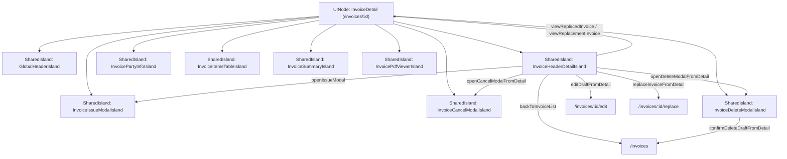

# UX & Screen Specification: InvoiceDetail (Chi Tiết Hóa Đơn)

> **Graph Node ID:** `InvoiceDetail`  
> **Route:** `/invoices/:id`  
> **Title:** `Invoice Details - Chi Tiết Hóa Đơn`  
> **Authentication & Role:** `AUTHENTICATED`  
> **Parent / Layout Context:** Root Main Application Layout  
> **Mounted Islands:** `GlobalHeaderIsland`, `InvoiceHeaderDetailIsland`, `InvoicePartyInfoIsland`, `InvoiceItemsTableIsland`, `InvoiceSummaryIsland`, `InvoicePdfViewerIsland`, `InvoiceIssueModalIsland`, `InvoiceCancelModalIsland`, `InvoiceDeleteModalIsland`

---

## 1. Executive Summary & Screen Purpose

The **InvoiceDetail** screen provides a comprehensive 360-degree inspection and lifecycle operations view of a single commercial invoice. It features a split-pane interactive interface combining structured invoice metadata, buyer/seller entity profiles, line item breakdowns, and a live embedded PDF document viewer (`InvoicePdfViewerIsland`).

This screen governs critical state transitions (`DRAFT` -> `ISSUED`, `ISSUED` -> `CANCELED`, `ISSUED` -> `REPLACED`) with rigorous visual safeguards, audit trails, and dual-link navigation for invoice replacement lineages.



---

## 2. Visual Hierarchy & Action Architecture

The action hierarchy dynamically adapts to the current invoice lifecycle state:

### 2.1 State-Based Primary Actions (Single CTA Priority)
* **When `DRAFT`:**
  - **Primary CTA:** `⚡ Phát Hành Hóa Đơn` (`openIssueModal` -> `InvoiceIssueModalIsland`)
  - **Visual:** Solid Emerald Button (`bg-emerald-600 hover:bg-emerald-700 text-white font-semibold shadow-md`). Prominently triggers the legal issuance flow.
* **When `ISSUED`:**
  - **Primary CTA:** `⬇ Tải Xuống PDF` (`downloadPdfFile` -> triggers direct binary stream download).
  - **Visual:** Solid Indigo/Primary Button (`bg-primary-600 hover:bg-primary-700 text-white`).
* **When `CANCELED` or `REPLACED`:**
  - **Primary CTA:** `⬇ Tải Xuống PDF` (View/Download historical archived copy).

### 2.2 Secondary Actions (Downgraded Controls)
* **When `DRAFT`:**
  - `✏ Chỉnh Sửa Hóa Đơn` (`editDraftFromDetail` -> navigates to `/invoices/:id/edit`).
  - `⎘ Nhân Bản Thành Bản Nháp Mới` (`cloneInvoiceFromDetail`).
* **When `ISSUED` (Root Invoice `originalInvoiceId == null`):**
  - `🔄 Lập Hóa Đơn Thay Thế` (`replaceInvoiceFromDetail` -> navigates to `/invoices/:id/replace`).
  - `⎘ Nhân Bản Thành Bản Nháp Mới` (`cloneInvoiceFromDetail`).
* **When `ISSUED` (Replacement Invoice `originalInvoiceId != null`):**
  - `⎘ Nhân Bản Thành Bản Nháp Mới` (`cloneInvoiceFromDetail`). Note: Replacement button is strictly disabled/hidden per 1-level replacement cap invariant.
* **When `CANCELED` / `REPLACED`:**
  - `⎘ Nhân Bản Thành Bản Nháp Mới` (`cloneInvoiceFromDetail`).

### 2.3 Destructive Actions (Strictly Scoped Red Buttons / Kebab Items)
* **When `DRAFT`:** `🗑 Xóa Bản Nháp` (`openDeleteModalFromDetail` -> opens `InvoiceDeleteModalIsland`).
* **When `ISSUED`:** `🚫 Hủy Hóa Đơn` (`openCancelModalFromDetail` -> opens `InvoiceCancelModalIsland`).

---

## 3. Screen Layout & Component Structure

```
+---------------------------------------------------------------------------------------------------+
|  [GlobalHeaderIsland] - Logo | Hóa Đơn Điện Tử | [Danh Sách Hóa Đơn] | [User Profile]             |
+---------------------------------------------------------------------------------------------------+
|                                                                                                   |
|  [InvoiceHeaderDetailIsland]                                                                      |
|  [← Quay lại danh sách]                                                                           |
|  Hóa Đơn: HD-2026-00042  [● ĐÃ PHÁT HÀNH]                                                         |
|  Ngày lập: 22/08/2026 14:30 | Ngày phát hành: 22/08/2026 15:00                                    |
|                                [⎘ Nhân Bản] [🔄 Thay Thế HĐ] [🚫 Hủy HĐ] [⬇ Tải PDF]              |
|                                                                                                   |
|  [Audit Banner - If Replacement / Canceled]                                                       |
|  ℹ Hóa đơn này thay thế cho hóa đơn gốc HD-2026-00018 [Xem hóa đơn gốc →]                         |
|---------------------------------------------------------------------------------------------------|
|  [SPLIT WORKSPACE LAYOUT]                                                                         |
|                                                                                                   |
|  LEFT PANEL (55% Width) - Structured Data          | RIGHT PANEL (45% Width) - Live PDF Stream    |
|                                                    |                                              |
|  [InvoicePartyInfoIsland]                          | [InvoicePdfViewerIsland]                     |
|  +-----------------------+-----------------------+ | +------------------------------------------+ |
|  | ĐƠN VỊ BÁN HÀNG       | ĐƠN VỊ MUA HÀNG       | | | [Zoom -] [100%] [Zoom +] [⎙ In] [⬇ Tải]   | |
|  | CTY TNHH GIẢI PHÁP... | CTY CP CÔNG NGHỆ XYZ  | | |------------------------------------------| |
|  | MST: 0101234567       | MST: 0319876543       | | |                                          | |
|  | Đ/c: Cầu Giấy, Hà Nội | Đ/c: Q.1, TP.HCM      | | |         [A4 EMBEDDED PDF VIEWER]         | |
|  +-----------------------+-----------------------+ | |         - Header & Red Stamp Badge       | |
|                                                    | |         - Buyer/Seller Table             | |
|  [InvoiceItemsTableIsland]                         | |         - Multi-page line items table    | |
|  +----+-----------------+-----+----+-------+-----+ | |         - Tax & Totals                   | |
|  | STT| Tên Hàng Hóa/DV | ĐVT | SL | ĐơnGiá| T.Tiền | |         - Vietnamese Words & Signatures  | |
|  |----+-----------------+-----+----+-------+-----+ | |                                          | |
|  | 1  | Bản quyền phần..| Gói | 2  | 10.000| 20.000 | |                                          | |
|  | 2  | Dịch vụ Setup   | Giờ | 5  |  1.000|  5.000 | |                                          | |
|  +----+-----------------+-----+----+-------+-----+ | |                                          | |
|                                                    | |                                          | |
|  [InvoiceSummaryIsland]                            | |                                          | |
|  Cộng tiền hàng:            25.000.000 ₫           | |                                          | |
|  Thuế suất GTGT (10%):       2.500.000 ₫           | |                                          | |
|  Tổng cộng thanh toán:      27.500.000 ₫           | |                                          | |
|  Số tiền bằng chữ: Hai mươi bảy triệu năm trăm     | |                                          | |
|  nghìn đồng chẵn.                                  | +------------------------------------------+ |
+----------------------------------------------------+----------------------------------------------+
```

---

## 4. Mounted Island Detailed Specifications

### 4.1 `InvoiceHeaderDetailIsland`
* **Navigation Trigger:** `backToInvoiceList` (`/invoices`) with breadcrumb link (`Trang chủ / Danh sách hóa đơn / HD-2026-00042`).
* **Metadata Badges:**
  - Invoice Number (`HD-YYYY-XXXXX`) in bold monospace.
  - Lifecycle Status Pill with glowing status indicator.
  - Creation timestamp & Issue timestamp formatted in Vietnamese standard (`DD/MM/YYYY HH:mm`).
* **Lineage Banners:**
  - **Replacement Notice (Child):** *"Hóa đơn này thay thế cho hóa đơn gốc **HD-2026-00018** (Ngày hủy: 20/08/2026)"* + Clickable badge `[Xem hóa đơn gốc]`.
  - **Replaced Notice (Parent):** *"Hóa đơn này đã được thay thế bởi hóa đơn mới **HD-2026-00045** (Ngày thay thế: 22/08/2026)"* + Clickable badge `[Xem hóa đơn thay thế]`.
  - **Cancellation Banner:** Alert box with red background detailing `Lý do hủy: [Nội dung lý do]` and cancellation date.

### 4.2 `InvoicePartyInfoIsland`
* **Dual Card Structure:**
  - **Seller Information Card (Bên Bán):** Legal company name, tax ID (MST), registered business address, phone number, email, bank account number & bank branch.
  - **Buyer Information Card (Bên Mua):** Buyer company/customer name, buyer tax code, registered office address, representative contact, payment method (`Chuyển khoản / Tiền mặt`).

### 4.3 `InvoiceItemsTableIsland`
* **Line Items Display (Up to 100 items supported):**
  - Numeric Index (`STT`).
  - Item Description (`Tên hàng hóa, dịch vụ`): Supports long string line-wrapping with `word-break: break-word`.
  - Unit (`Đơn vị tính` - e.g., Cái, Chiếc, Gói, Giờ).
  - Quantity (`Số lượng`): Decimal-formatted.
  - Unit Price (`Đơn giá`): VND formatted with thousand separators.
  - Line Total (`Thành tiền`): Calculated as `Quantity * UnitPrice`.

### 4.4 `InvoiceSummaryIsland`
* **Financial Calculations Breakdown:**
  - **Tiền hàng (Subtotal):** Total before tax.
  - **Thuế suất GTGT (VAT Rate):** Formatted percentage (e.g., `8%`, `10%`).
  - **Tiền thuế GTGT (VAT Amount):** Accurately calculated tax amount.
  - **Tổng tiền thanh toán (Grand Total):** Prominently highlighted in large typography (`text-2xl font-bold text-primary-700`).
  - **Số tiền bằng chữ (Vietnamese Words):** Dynamically rendered from backend utility `convertVndToWords(totalAmount)` (e.g., *"Hai mươi bảy triệu năm trăm nghìn đồng chẵn.*") with italic serif typography for high legibility.

### 4.5 `InvoicePdfViewerIsland` (Live PDF Stream & Toolbar)
* **Actions:**
  - `previewPdfStream` -> Streams inline PDF from `/api/v1/invoices/:id/pdf` into responsive iframe/PDF.js renderer.
  - `downloadPdfFile` -> Fetches `/api/v1/invoices/:id/pdf?download=true` triggering browser download.
* **Viewer Toolbar Controls:**
  - Zoom controls (`-`, `+`, `Fit Width`, `100%`).
  - Page navigation (`Trang 1 / 2`).
  - Direct Print trigger (`window.print()` / PDF native print).
  - Fullscreen modal toggle.
* **Loading State:** `isLoadingPdf == true` displays an animated pulse placeholder previewing the A4 page aspect ratio.

### 4.6 In-Page State Modals

#### `InvoiceIssueModalIsland` (Issuance Confirmation Modal)
* **Trigger:** Click `Phát Hành Hóa Đơn` from `InvoiceHeaderDetailIsland`.
* **Guard:** Verifies `status === 'DRAFT'`.
* **Animation:** `scaleUp` entrance.
* **Visual Presentation:**
  - Header: Verified Shield Icon in emerald circle + Title: **"Xác Nhận Phát Hành Hóa Đơn"**.
  - Notice Alert: *"Sau khi phát hành, hóa đơn sẽ chính thức có giá trị pháp lý, được khóa chỉnh sửa và hệ thống sẽ tự động khởi tạo file PDF lưu trữ."*
  - Invoice Summary Review: Displays invoice number, buyer name, and total amount payable.
  - Footer Buttons:
    - `[Hủy Bỏ]` (Ghost button).
    - `[Xác Nhận Phát Hành Ngay]` (Solid Emerald Button `bg-emerald-600 hover:bg-emerald-700 text-white`).
* **Backend Execution:** `issueInvoice(id)`.
* **Feedback:** Transitions status to `ISSUED`, loads PDF preview immediately, shows success celebration toast.

#### `InvoiceCancelModalIsland` (Cancellation Reason Modal)
* **Trigger:** Click `Hủy Hóa Đơn` from `InvoiceHeaderDetailIsland`.
* **Guard:** Verifies `status === 'ISSUED'`.
* **Form Field:** Required `cancelReason` textarea (min 5 chars).
* **Backend Execution:** `cancelInvoice(id, { cancelReason })`.
* **Feedback:** Transitions status to `CANCELED`, locks all edits, updates cancellation banner in header.

#### `InvoiceDeleteModalIsland` (Draft Physical Deletion Modal)
* **Trigger:** Click `Xóa Bản Nháp` from `InvoiceHeaderDetailIsland`.
* **Guard:** Verifies `status === 'DRAFT'`.
* **Backend Execution:** `deleteDraftInvoice(id)`.
* **Feedback:** Navigates back to `InvoiceList` (`/invoices`) with deletion confirmation toast.

---

## 5. Micro-Interactions, Feedback & State Transitions

| Trigger / Event | UI Transition / Animation | Visual Feedback |
|---|---|---|
| Page Load | `fetchInvoiceDetail` | Skeleton layout loading left and right panels simultaneously. |
| Issue Invoice Confirm | `InvoiceIssueModalIsland`: `scaleUp` -> `confirmIssueInvoice` | Status badge transitions from Gray to Glowing Emerald with confetti micro-animation. |
| PDF Generating | `isLoadingPdf == true` | Right panel displays shimmer A4 placeholder with "Đang tạo bản xem trước PDF...". |
| Switch Tabs (Mobile) | Tab slider animation (200ms ease-in-out) | Smooth sliding between "Thông tin hóa đơn" and "Bản xem trước PDF". |

---

## 6. Edge Cases & Error States

### 6.1 Invoice Not Found (404 Error)
* **Visual:** Document with exclamation mark icon.
* **Heading:** *"Không tìm thấy hóa đơn"*
* **Description:** *"Hóa đơn với mã định danh này không tồn tại hoặc đã bị xóa khỏi hệ thống."*
* **CTA Button:** `[Quay Lại Danh Sách Hóa Đơn]` (`/invoices`).

### 6.2 Long Item Names / Unbroken Strings (FR-11)
* Line items with ultra-long descriptions (e.g., 200+ characters or unbroken strings) wrap cleanly within the table column using CSS `word-break: break-word; hyphens: auto;` without breaking column alignment.

### 6.3 Multi-Page Invoice Handling (FR-12)
* When an invoice contains 20+ to 100 items, the live PDF viewer renders standard multi-page pagination with repeated table headers on every page and signatures anchored strictly on the final page.

---

## 7. Responsive Specifications

* **Desktop (>= 1280px):** 55% / 45% side-by-side split screen layout (Left: structured forms/tables, Right: live sticky PDF viewer).
* **Tablet (768px - 1279px):** Stacked vertical view (Top: Invoice metadata & Line items, Bottom: Interactive PDF viewer).
* **Mobile (< 768px):** Top segmented tab switch (`[Thông Tin Chi Tiết]` | `[Xem Bản PDF]`) allowing users to easily toggle between structured data and full-screen mobile PDF preview.
