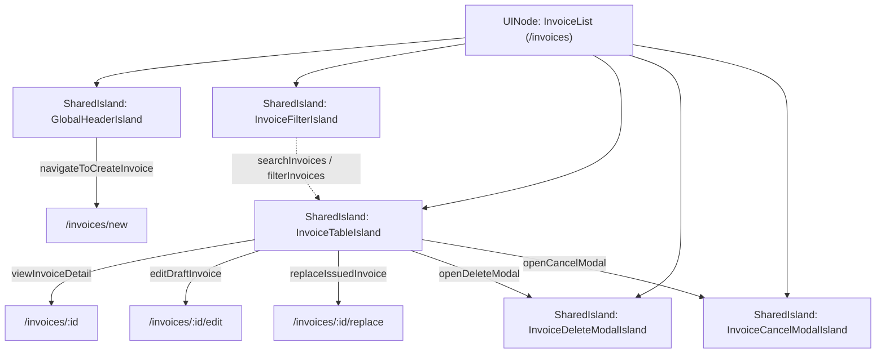

# UX & Screen Specification: InvoiceList (Danh Sách Hóa Đơn)

> **Graph Node ID:** `InvoiceList`  
> **Route:** `/invoices`  
> **Title:** `Invoice Management - Danh Sách Hóa Đơn`  
> **Authentication & Role:** `AUTHENTICATED`  
> **Parent / Layout Context:** Root Main Application Layout  
> **Mounted Islands:** `GlobalHeaderIsland`, `InvoiceFilterIsland`, `InvoiceTableIsland`, `InvoiceDeleteModalIsland`, `InvoiceCancelModalIsland`

---

## 1. Executive Summary & Screen Purpose

The **InvoiceList** screen serves as the operational command center for managing commercial invoices throughout their complete lifecycle (`DRAFT`, `ISSUED`, `CANCELED`, `REPLACED`). It empowers accounting staff and business operators to rapidly search, filter, preview, clone, edit, cancel, and replace invoices while maintaining strict adherence to Vietnamese financial regulations and database integrity invariants.



---

## 2. Visual Hierarchy & Action Architecture

### 2.1 Primary Action (Single CTA Priority)
* **Action:** `+ Tạo Hóa Đơn Mới` (`navigateToCreateInvoice` -> `/invoices/new`)
* **Placement:** Top-right action cluster of the Page Header Bar & Global Navigation.
* **Visual Style:** High-contrast solid primary button (`bg-primary-600 hover:bg-primary-700 text-white font-medium shadow-sm hover:shadow transition-all duration-200`).
* **Keyboard Shortcut:** `Alt + N` / `Cmd + N`.

### 2.2 Secondary Actions (Downgraded Contextual Controls)
* **Search Input:** Fast omni-search box (supports invoice number, buyer company name, tax ID) with keyboard trigger `Ctrl + K` or `/`.
* **Quick Status Tabs:** Horizontal segmented filter pills (`Tất cả`, `Bản nháp`, `Đã phát hành`, `Đã thay thế`, `Đã hủy`).
* **Date Range / Custom Filter Popover:** Ghost filter button with badge indicator when active filters are applied.
* **Table Refresh:** Subtle icon button with rotating animation on fetch.

### 2.3 Tertiary Actions (Row-Level Actions strictly scoped by State Machine)
Row actions are encapsulated in a responsive action column with clean iconography and a dropdown kebab menu (`...`) to prevent visual clutter:
* `DRAFT` State:
  1. `Xem Chi Tiết` (Primary Row Click / Eye Icon)
  2. `Chỉnh Sửa` (Pencil Icon / Outline button)
  3. `Nhân Bản` (Copy Icon / Kebab option)
  4. `Xóa Bản Nháp` (Trash Icon / Destructive Red Kebab option)
* `ISSUED` State (Root Invoice `originalInvoiceId == null`):
  1. `Xem Chi Tiết` (Primary Row Click / Eye Icon)
  2. `Lập Hóa Đơn Thay Thế` (Exchange/Replace Icon / Warning Accent)
  3. `Nhân Bản` (Copy Icon / Kebab option)
  4. `Hủy Hóa Đơn` (Cancel/Ban Icon / Destructive Red Kebab option)
* `ISSUED` State (Replacement Invoice `originalInvoiceId != null`):
  1. `Xem Chi Tiết` (Primary Row Click)
  2. `Nhân Bản` (Copy Icon)
  3. `Hủy Hóa Đơn` (Destructive Red Kebab option)
* `CANCELED` / `REPLACED` States (Terminal Locked States):
  1. `Xem Chi Tiết` (View only)
  2. `Nhân Bản` (Clone into new Draft)

---

## 3. Screen Layout & Component Structure

```
+-----------------------------------------------------------------------------------+
|  [GlobalHeaderIsland]                                                             |
|  Logo | Hóa Đơn Điện Tử      [Tìm kiếm... Ctrl+K]      [+ Tạo Hóa Đơn] [User Profile] |
+-----------------------------------------------------------------------------------+
|                                                                                   |
|  [Page Header & Summary Metrics Bar]                                              |
|  Danh Sách Hóa Đơn (Tổng 1,248)                                                   |
|  +--------------------+ +--------------------+ +--------------------+ +---------+ |
|  | Tổng Doanh Thu     | | Đã Phát Hành       | | Bản Nháp           | | Đã Hủy  | |
|  | 14.850.000.000 đ   | | 1,180 hóa đơn      | | 42 hóa đơn         | | 26 HĐ   | |
|  +--------------------+ +--------------------+ +--------------------+ +---------+ |
|                                                                                   |
|  [InvoiceFilterIsland]                                                            |
|  [🔍 Tìm kiếm mã số, KH, MST...] [Tất cả | Nháp | Đã phát hành | Thay thế | Đã hủy]  |
|  [📅 Khoảng ngày ▼] [🏢 Phân loại ▼]                      [↺ Làm mới] [✖ Xóa lọc] |
|                                                                                   |
|  [InvoiceTableIsland]                                                             |
|  +------------------------------------------------------------------------------+ |
|  | [x] | Số HĐ      | Ngày Tạo   | Khách Hàng / MST      | Tổng Tiền    | Trạng Thái | ... |
|  |-----+------------+------------+-----------------------+--------------+------------|---| |
|  | [ ] | HD-2026-001| 22/08/2026 | CTY TNHH ABC (010...) | 25.000.000 đ | [Đã phát hành] |
|  | [ ] | HD-2026-002| 22/08/2026 | CTY CP XYZ (031...)   | 88.200.000 đ | [Bản nháp]    |
|  +------------------------------------------------------------------------------+ |
|  Hiển thị 1 - 20 / 1,248 kết quả                      [<] [1] [2] [3] ... [63] [>] |
+-----------------------------------------------------------------------------------+
```

---

## 4. Mounted Island Detailed Specifications

### 4.1 `GlobalHeaderIsland`
* **Role:** Global persistent header across all application pages.
* **Branding:** Modern enterprise badge with "Hệ Thống Quản Lý Hóa Đơn".
* **Navigation Links:**
  - `Danh Sách Hóa Đơn` (`/invoices` - highlighted with active underline indicator).
  - `Báo Cáo Thống Kê` (`/reports`).
  - `Cài Đặt Hệ Thống` (`/settings`).
* **Global Actions:**
  - `[+ Tạo Hóa Đơn Mới]` (`navigateToCreateInvoice`).
  - User avatar dropdown (Logout, Profile info).

### 4.2 `InvoiceFilterIsland`
* **State Mutation:** `searchInvoices`, `filterInvoices` -> updates `InvoiceTableIsland` dataset.
* **Fields & Controls:**
  1. **Omni-Search Bar:** Text input with 300ms debounce. Placeholder: *"Tìm theo Số HĐ (HD-YYYY-xxxxx), Tên khách hàng, Mã số thuế..."*.
  2. **Status Filter Tabs (Segmented Button Group):**
     - `Tất cả` (All)
     - `Bản nháp` (DRAFT - Slate/Gray badge)
     - `Đã phát hành` (ISSUED - Emerald/Green badge)
     - `Đã thay thế` (REPLACED - Amber/Orange badge)
     - `Đã hủy` (CANCELED - Rose/Red badge)
  3. **Date Range Picker Dropdown:** Quick presets (*Hôm nay*, *7 ngày qua*, *Tháng này*, *Quý này*, *Tùy chọn*).
  4. **Active Filters Chip Bar:** When filters are active, displays removable tag chips (e.g., `Trạng thái: Bản nháp [x]`, `Từ: 01/08/2026 [x]`) and a `[Xóa tất cả bộ lọc]` ghost button.

### 4.3 `InvoiceTableIsland`
* **Columns Definition:**
  1. **Số Hóa Đơn (`invoiceNumber`):** Monospace font with subtle link styling (`text-primary-600 font-mono font-semibold hover:underline`). If `originalInvoiceId` is present, displays a small replacement badge `[Thay thế]`.
  2. **Ngày Lập / Phát Hành (`createdAt` / `issueDate`):** Standard Vietnamese date format `DD/MM/YYYY HH:mm`.
  3. **Khách Hàng / Đơn Vị Mua (`buyerName` & `buyerTaxCode`):** Two-line stacked text: Primary buyer company name (bold) and secondary tax code (muted small font).
  4. **Tổng Tiền Thanh Toán (`totalAmount`):** Right-aligned formatted VND currency (e.g., `125.400.000 ₫`) with distinct currency symbol.
  5. **Thuế GTGT (`vatRate` & `vatAmount`):** Percentage tag (e.g., `10%`) and calculated tax amount.
  6. **Trạng Thái (`status`):**
     - `DRAFT`: Gray pill with subtle border (`bg-slate-100 text-slate-700 border-slate-300`).
     - `ISSUED`: Emerald pill with glowing indicator dot (`bg-emerald-50 text-emerald-700 border-emerald-300`).
     - `REPLACED`: Amber pill with icon indicator (`bg-amber-50 text-amber-700 border-amber-300`).
     - `CANCELED`: Rose pill with strikethrough styling (`bg-rose-50 text-rose-700 border-rose-300 line-through`).
  7. **Hành Động (Actions):** Compact button group / kebab trigger with hover tooltips.

* **Interactivity:**
  - Double-click or single-click row navigates to `InvoiceDetail` (`/invoices/:id`).
  - Row hover highlight (`bg-slate-50/80 transition-colors`).
  - Column sorting with ascending/descending arrow icons on `invoiceNumber`, `createdAt`, `totalAmount`.

### 4.4 `InvoiceDeleteModalIsland` (In-Page State Modal)
* **Trigger:** Click `Xóa Bản Nháp` action from a `DRAFT` row.
* **Guard:** Verifies `status === 'DRAFT'` via `validateDraftModification`.
* **Animation:** `scaleUp` transition (200ms ease-out, `opacity: 0 -> 1`, `scale: 0.95 -> 1`).
* **Visual Presentation:**
  - Header: Danger icon in soft red circle + Title: **"Xóa Bản Nháp Hóa Đơn"**.
  - Body: *"Bạn có chắc chắn muốn xóa bản nháp hóa đơn **HD-2026-00042** của khách hàng **Công ty TNHH ABC**? Hành động này sẽ xóa hoàn toàn dữ liệu và không thể hoàn tác."*
  - Footer Buttons:
    - `[Hủy Bỏ]` (Ghost / Outline button, auto-focus).
    - `[Xác Nhận Xóa]` (Solid Red Danger button `bg-rose-600 hover:bg-rose-700 text-white`).
* **Backend Execution:** Calls `deleteDraftInvoice(id)`.
* **Feedback:** Optimistic table row removal + success toast *"Đã xóa bản nháp hóa đơn HD-2026-00042 thành công"*.

### 4.5 `InvoiceCancelModalIsland` (In-Page State Modal)
* **Trigger:** Click `Hủy Hóa Đơn` action from an `ISSUED` row.
* **Guard:** Verifies `status === 'ISSUED'` via `validateCancelTransition`.
* **Animation:** `scaleUp` transition (200ms ease-out).
* **Visual Presentation:**
  - Header: Warning amber/red icon + Title: **"Hủy Hóa Đơn Đã Phát Hành"**.
  - Notice Alert: *"Lưu ý: Hóa đơn đã phát hành sau khi hủy sẽ chuyển sang trạng thái CANCELED và không thể khôi phục theo quy định."*
  - Form Input: **Lý do hủy hóa đơn (Bắt buộc):**
    - Textarea input (min 5 characters, max 500 characters, counter indicator).
    - Placeholder: *"Nhập lý do hủy hóa đơn (ví dụ: Sai sót thông tin người mua, thỏa thuận hủy dịch vụ...)"*.
    - Validation error feedback if submitted empty.
  - Footer Buttons:
    - `[Đóng]` (Ghost button).
    - `[Xác Nhận Hủy Hóa Đơn]` (Solid Danger button, disabled if `cancelReason.trim().length < 5`).
* **Backend Execution:** Calls `cancelInvoice(id, { cancelReason })`.
* **Feedback:** Instant status badge mutation to `CANCELED` + success toast *"Hóa đơn HD-2026-00012 đã được hủy"*.

---

## 5. Micro-Interactions, Feedback & State Transitions

| Trigger / Event | UI Transition / Animation | Visual Feedback |
|---|---|---|
| Initial Page Load / Filter Apply | `InvoiceTableIsland`: `fadeIn` + Table Skeleton Loader (5 rows shimmer) | Skeleton rows matching column widths prevent layout shift (CLS). |
| Delete Modal Open | `InvoiceDeleteModalIsland`: `scaleUp` | Modal backdrop blur (`backdrop-blur-sm bg-black/40`) + smooth dialog entrance. |
| Cancel Modal Open | `InvoiceCancelModalIsland`: `scaleUp` | Focus auto-moves to `cancelReason` textarea. |
| Duplicate / Clone Action | `cloneInvoiceFromList` (POST `/api/v1/invoices/:id/clone`) | Button shows subtle spinner -> Toast notification *"Đã nhân bản hóa đơn thành công! [Xem bản nháp mới]"*. |
| Search Input Typing | Debounce 300ms | Input trailing spinner appears during active query fetching. |

---

## 6. Edge Cases & Error States

### 6.1 Empty State: No Invoices in System (Zero Data)
* **Visual:** Centered high-grade illustration/icon representing empty document ledger.
* **Heading:** *"Chưa có hóa đơn nào được tạo"*
* **Description:** *"Bắt đầu quản lý tài chính và xuất hóa đơn bằng cách tạo bản nháp hóa đơn đầu tiên của bạn."*
* **CTA Button:** `[+ Tạo Hóa Đơn Mới]` (Primary Large Button).

### 6.2 Empty State: Search / Filter No Results
* **Visual:** Magnifying glass with question mark icon.
* **Heading:** *"Không tìm thấy hóa đơn phù hợp"*
* **Description:** *"Không có kết quả nào khớp với từ khóa tìm kiếm hoặc bộ lọc hiện tại. Vui lòng thử lại với tiêu chí khác."*
* **CTA Button:** `[Xóa Bộ Lọc]` (Outline Secondary Button) -> resets all filters to default.

### 6.3 Error State: Network Failure / Backend Unavailable
* **Visual:** Warning triangle card banner with red accent border.
* **Heading:** *"Không thể tải danh sách hóa đơn"*
* **Description:** *"Đã xảy ra lỗi kết nối với máy chủ API. Vui lòng kiểm tra đường truyền và thử lại."*
* **CTA Button:** `[↺ Tải Lại Dữ Liệu]` (Solid button).

---

## 7. Accessibility & Responsive Specifications

* **Keyboard Navigation:**
  - Full tab index traversal across search, status filters, and table rows.
  - `Escape` key closes active Delete/Cancel modal dialogs.
  - `Enter` on a focused row triggers navigation to `InvoiceDetail`.
* **Screen Reader (ARIA):**
  - Table structured with standard `role="table"`, `<th scope="col">`, `aria-sort="ascending|descending"`.
  - Modals equipped with `role="dialog"`, `aria-modal="true"`, `aria-labelledby` referencing modal titles.
* **Responsive Breakpoints:**
  - **Desktop (>= 1280px):** Full multi-column view with inline quick action buttons.
  - **Tablet (768px - 1279px):** Columns condensed, secondary fields (Tax rate, subtotal) collapsed into expandable row drawer.
  - **Mobile (< 768px):** Table converts into stacked card view with clear status badges, primary amount, and floating action button (FAB) for `+ Tạo Hóa Đơn`.
